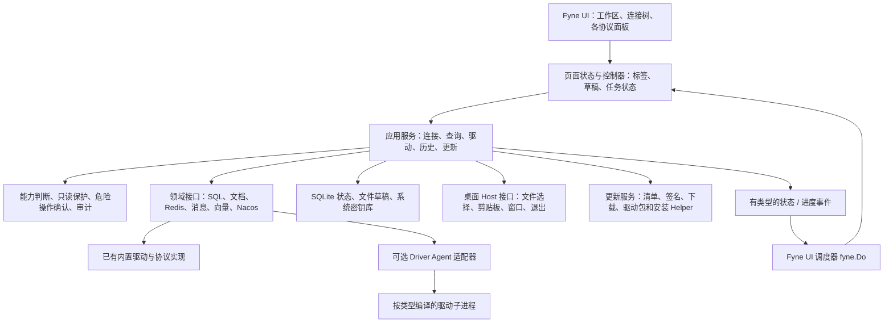
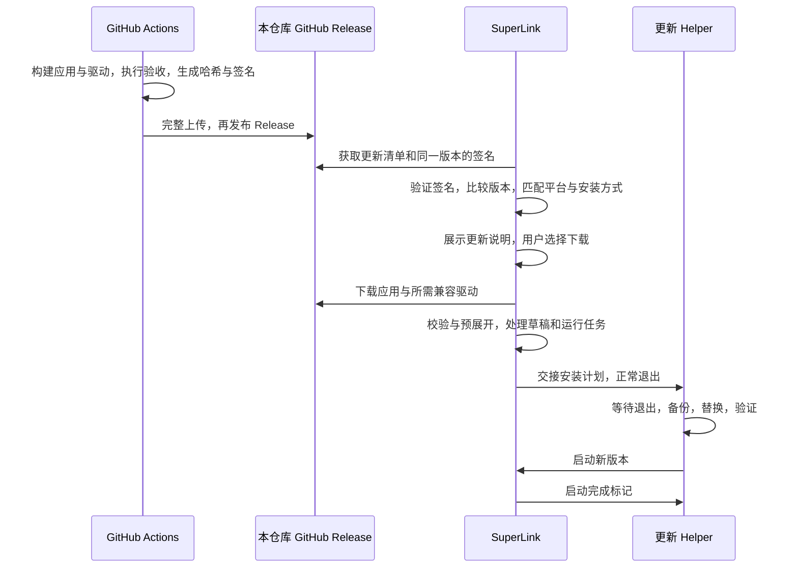

# SuperLink 整体设计与实施计划

> 状态：已获批准；v0.1.0 原生 Alpha 已实现并完成本次自检。日期：2026-10-01。
> **范围已更新**：用户随后要求完整功能和界面一比一复刻，以[完整对齐设计](2026-10-01-superlink-parity-design.md)为当前验收范围；本文件中的首版边界保留作历史设计，不作为缩减交付范围的依据。
> 实际功能、验证范围和未完成项以 [README](../../README.md) 与 [自检报告](../selfcheck-2026-10-01.md) 为准。下文保留完整实施目标，不将计划中的全部功能标记为已交付。
> 已补充[本机 SuperLink 页面与操作对照](../superlink-ui-observation-2026-10-01.md)，日常库表工作流的后续补齐按该文档逐项验收；入口数量不作为功能对齐的判据。
>
> 目标仓库：[ealink1/super-link](https://github.com/ealink1/super-link)，Git 地址：`git@github.com:ealink1/super-link.git`。
>
> 用户已确定：首版尽量覆盖 SuperLink 全部数据库类型，再逐步补高级功能；不包含 JVM 管理连接器。
>
> 实施目录：`.`。独立 Go 模块、Fyne 界面和基础工作台已建立；实际完成情况以 README 和自检报告为准。暂未提交或推送。
>
> SuperLink 参考基线：`6e20b6ddf56b2ae76f7e5d5c6a3505cef1edc871`。后续若更换基线，先重新核对驱动和协议差异。

## 1. 建议采用的总体路线

新建独立 Go + Fyne 桌面工程，逐项迁入 SuperLink 的驱动、连接、协议处理和业务规则；桌面界面、应用服务、事件机制、配置命名空间和发布流程按 Fyne 重建。

首版以“数据源覆盖完整、基础操作可靠”为目标。先打通各类数据源的基础工作台，再完善高级编辑、结构设计、同步、AI 与运维能力。范围覆盖不是把所有入口都做成 SQL 编辑器：Redis、消息队列、向量服务、Nacos 需要自己的操作界面。

推荐的首版边界：

- 覆盖当前目录的 **36 类固定数据源 + Custom Driver/DSN**，共 37 个连接入口；按用户要求排除 JVM 管理连接器。
- 每种类型具备连接配置、连接测试、凭据保存、基础对象浏览、适合该协议的查询或读取、错误反馈与资源释放。
- SQL 类型提供多标签查询、选中内容执行、基础结果表格、结果预算、取消、历史和草稿。
- Redis、MongoDB、Elasticsearch、向量服务、消息系统、Nacos 提供可使用的基础专门面板。
- 提供驱动安装管理、公开 GitHub Release 更新源、下载校验和经过验证的平台安装方式。
- 首版结果表格以只读浏览为主；SQL 控制台允许有权限的用户显式执行写语句，并落实只读和危险操作保护。
- 表格增删改、完整结构设计器、跨库同步、CDC、AI Agent、MCP、云备份和复杂诊断安排在后续版本。

实施顺序：**组件与驱动原型 → 公共连接和查询流程 → 全类型接入 → 各协议基础工作台 → 跨平台验收与发布 → 高级功能。** MySQL、PostgreSQL、SQLite 用来验证公共流程，不能据此将首版验收范围缩成这三类。

## 2. 首版数据源范围与验收清单

### 2.1 “支持”的判定

每个连接入口都记录以下状态：`规划中 → 代码接入 → 构建通过 → 实际连接验证 → 基础功能验收通过`。另行记录平台限制、服务端版本、测试日期和未支持能力。

只有最后一步通过，才能在发布说明中标记为“已验证支持”。适配器单测、构建成功和协议兼容推测不能替代真实服务验收。没有国产库或专有服务测试环境时，保留“已集成、待环境验证”，不把它算进已验证数量。

### 2.2 逐类型基础能力

下表是首版目标，不是现有 SuperLink 已实现的功能。类型键来自 [SuperLink 能力契约][g-capability]；`custom` 来自 [数据库工厂][g-factory]。

| 序号 | 数据源 / 类型键 | 首版基础工作台与验收重点 |
| --- | --- | --- |
| 1 | MySQL / `mysql` | 库、表、列、索引浏览；SQL 查询与执行；字符集、TLS、SSH；基础结果类型 |
| 2 | GoldenDB / `goldendb` | 沿用已有 MySQL 接入路径；验证目标服务版本和认证；不能只用 MySQL 测试代替 |
| 3 | PostgreSQL / `postgres` | 数据库与 schema 导航；SQL 查询与执行；搜索路径、大小写标识符和类型 |
| 4 | Oracle / `oracle` | Service Name / SID 配置；schema、对象浏览与查询；分页和日期、数值类型 |
| 5 | MariaDB / `mariadb` | 兼容连接和 SQL 面板；认证、元数据差异及版本验证 |
| 6 | OceanBase / `oceanbase` | 区分 MySQL / Oracle 租户模式；模式对应的对象和查询能力 |
| 7 | Apache Doris / `diros` | 面向 SQL 的库表浏览和查询；保留上游 `diros` 键并接受 `doris` 别名 |
| 8 | StarRocks / `starrocks` | 库表浏览、查询、结果预算；准确表达分析型数据库限制 |
| 9 | Sphinx / `sphinx` | SphinxQL 查询及可用索引浏览；不显示不支持的关系库操作 |
| 10 | SQL Server / `sqlserver` | 实例、数据库、schema 配置；查询、元数据和分页 |
| 11 | SQLite / `sqlite` | 本地文件选择、只读打开、查询；内存数据库保持同一会话；离线可用 |
| 12 | DuckDB / `duckdb` | 文件数据库、查询和类型；驱动本地依赖与包分发验证 |
| 13 | 达梦 / `dameng` | 连接、schema / 表浏览、查询；编码和服务版本；驱动事务能力按契约开放 |
| 14 | 金仓 / `kingbase` | 连接、元数据、查询；服务端模式、认证和驱动版本 |
| 15 | 瀚高 / `highgo` | 连接与查询；保留上游特殊认证实现及本地替换依赖 |
| 16 | 海量 / `vastbase` | 连接、schema、查询；实际兼容性验证 |
| 17 | openGauss / `opengauss` | 认证、schema、查询；不得只按 PostgreSQL 推定可用 |
| 18 | GaussDB / `gaussdb` | 接入模式、认证、元数据和查询；匹配所选驱动支持范围 |
| 19 | InterSystems IRIS / `iris` | 原生接入配置、对象和查询；校验平台原生库和运行依赖 |
| 20 | InterSystems Caché / `cache` | 使用已有接入实现；原生依赖、服务版本和查询验证 |
| 21 | MongoDB / `mongodb` | 数据库、集合浏览；原生文档查询、JSON 查看；认证、TLS与驱动版本 |
| 22 | TDengine / `tdengine` | 对应传输模式、数据库与时序对象、查询；本地依赖按实际方案检查 |
| 23 | Apache IoTDB / `iotdb` | 数据库 / 路径 / 设备 / 时间序列浏览和查询；按服务端模型适配 |
| 24 | ClickHouse / `clickhouse` | 数据库、表、查询；连接协议、取消、返回预算和类型 |
| 25 | Trino / `trino` | catalog / schema / table 导航；查询状态、取消和分页结果 |
| 26 | Elasticsearch / `elasticsearch` | 索引浏览、文档查询、REST Console；区分 JSON / NDJSON 请求 |
| 27 | Redis / `redis` | SCAN 分批浏览 Key；类型、TTL、值查看；命令执行和模式配置 |
| 28 | Chroma / `chroma` | Collection 浏览、条目读取、原生向量查询及参数校验 |
| 29 | Qdrant / `qdrant` | Collection、Point、Payload 浏览；向量检索和分页 |
| 30 | Milvus / `milvus` | 数据库 / Collection / schema 浏览；检索表达式、向量类型和维度 |
| 31 | RocketMQ / `rocketmq` | Topic 浏览、受控读取消息、停止读取；显式发布到测试 Topic |
| 32 | MQTT / `mqtt` | Broker 连接、Topic Filter 订阅、QoS、消息展示；显式发布与停止 |
| 33 | Kafka / `kafka` | Topic / Partition 浏览；限量读取；显式发布；禁止隐式改变业务消费位点 |
| 34 | RabbitMQ / `rabbitmq` | vhost、队列信息；明确说明读取方式和 ACK 影响；显式发布 |
| 35 | Pulsar / `pulsar` | Tenant / Namespace / Topic 配置；受控消息读取、停止和显式发布 |
| 36 | Nacos / `nacos` | Namespace、配置列表、内容查看、服务实例浏览；首版写入通过显式操作保护 |
| 37 | Custom Driver/DSN / `custom` | 已注册 Go SQL 驱动名称和 DSN；列出实际可用驱动；不能承诺任意 JDBC / ODBC 动态加载 |

### 2.3 跨类型的能力约束

建立 `Capabilities` 注册表，描述导航、查询语言、取消、参数绑定、事务、结果编辑、结构变更、消息发布和运行时依赖。初期尽量继承上游能力契约，再增加 Fyne 页面所需字段。

- 界面按能力显示按钮，应用服务再次检查能力和保护策略。
- 用 `Unsupported / Supported / RuntimeProbe` 区分不支持、确定支持和连接后才能确定。
- 用具体原因解释按钮不可用，例如“当前结果没有可定位主键”或“该驱动未提供事务”。
- 同一类型的能力允许随服务端版本、接入模式、驱动版本和用户权限变化。
- Nacos 不硬塞进 SQL `Database` 接口；共享连接生命周期和命令分发，保留各自领域接口。

## 3. 三种实施方案比较

| 方案 | 做法 | 优点 | 代价 / 风险 | 结论 |
| --- | --- | --- | --- | --- |
| A. 新 Fyne 工程 + 选择性迁入 Go 后端 | 新模块和应用服务，复用驱动 / 协议 / 规则，重建 UI | 适合独立仓库；保留全类型基础；逐步清除 Wails 耦合 | 需要梳理依赖、迁移配置和补齐 Fyne 组件 | **推荐** |
| B. 完整复制 SuperLink 后逐步替换桌面壳 | 搬入所有代码，先保留原 `App` 对象 | 前期可快速调用已有业务入口 | Wails、React、巨型绑定层及多宿主状态仍然存在；后期清理成本高 | 可用于短期研究，不作为正式结构 |
| C. 从零重写全部驱动与功能 | 只参考产品流程，自写所有接入 | 结构自由、历史依赖少 | 37 入口会反复处理认证、方言、取消和平台依赖；验收工作最多 | 不符合首版广覆盖目标 |

重要限制：Go 的 `internal` 包有导入可见性规则，新仓库不能直接 `go get` 后导入 SuperLink 的 `internal/db` 等包。首阶段选择带来源记录的源码迁入，修正模块路径；未来双方维护者愿意合作时，再考虑抽公共 SDK。[Go internal 包规则](https://go.dev/doc/go1.4#internalpackages)

### 3.1 迁入规则

1. 固定上游 commit；建立 `UPSTREAM.md`，记录文件来源、原路径、修改和同步日期。
2. 保留适用的许可、版权声明和上游 NOTICE；将修改说明写进迁移记录。SuperLink 当前使用 Apache-2.0，按其再分发条款处理。[上游许可][g-license]、[Apache-2.0](https://www.apache.org/licenses/LICENSE-2.0)
3. 先迁驱动、类型、SSH / TLS / 代理及必要工具，再按依赖迁应用业务。保留 `third_party` 中必要的本地替换实现。
4. 更新模块名为 `github.com/ealink1/super-link`，避免继续使用 `SuperLink-Wails`。
5. 不直接把 `internal/app` 的巨大 `App` 实例作为新 UI 后端。将所需业务拆入应用服务，桌面操作通过接口提供。
6. 复用测试中真实表达协议行为、类型转换和保护边界的部分，调整路径与契约；不为了表面覆盖率搬入全部旧 UI 测试。
7. 搜索直接及间接 Wails 依赖。已发现 AI 的数据目录选择仍调用 Wails 文件对话框，不能把整个 AI 目录当作完全无 UI 耦合的库。[耦合实例][g-ai-host]
8. 上游后续更新按驱动或领域逐项比较，不定期整仓覆盖新工程。

## 4. 整体架构

采用进程内分层应用，保留可选驱动进程。常规 UI 到应用服务之间使用 Go 类型；驱动代理进程之间继续使用有版本的 IPC 协议。首版无需运行本地 HTTP 服务。



### 4.1 依赖方向

- `ui` 可以依赖应用服务接口和领域 DTO；驱动、存储与领域包不导入 Fyne。
- `application` 管理完整操作流程、保护策略和资源生命周期；不承担绘制和控件布局。
- `domain` 描述业务对象、能力、错误、查询会话、任务，不读取全局窗口或直接弹窗。
- `infra` 实现驱动、IPC、HTTP、文件、SQLite 和凭据存储。
- `bootstrap` 负责构建对象并注入依赖；禁止到处使用全局 `CurrentApp`。
- 桌面 Host 接口只覆盖必要动作，初期不建设通用插件或远程 RPC 框架。

### 4.2 应用服务边界

| 服务 | 主要职责 |
| --- | --- |
| ConnectionService | 配置校验、测试、打开与关闭、SSH / TLS、健康状态、凭据引用 |
| CatalogService | 按连接能力浏览库、schema、表、集合、索引、Topic、Namespace 等 |
| QueryService | SQL / 文档 / REST 查询分发、会话、参数、预算、取消、结果事件 |
| DriverService | 驱动状态、下载、签名校验、安装、版本协商、进程健康与卸载 |
| CommandPolicy | 只读连接、危险操作分类、确认凭证、写入结果不确定性 |
| HistoryService / WorkspaceService | 历史、草稿、标签恢复、收藏、连接和结果上下文 |
| 专门领域服务 | Redis、消息、向量、Nacos 的协议动作与生命周期 |
| UpdateService | 版本检查、下载任务、安装状态、退出协调和启动后检查 |

新应用服务返回具体数据类型与 `error`，不把旧的 `QueryResult{Success, Message, Data:any}` 作为所有入口的唯一契约。迁入旧驱动时允许内部适配，逐步收敛到可检查的类型。

## 5. 建议目录与工程约束

以下是实施时的目标结构，目前尚未创建这些生产文件：

```text
superlink/
├── cmd/
│   ├── superlink/             # Fyne 主程序
│   ├── driver-agent/          # 通过构建标签选择具体可选驱动
│   └── navi-updater/          # 必要平台的安装 / 退出等待 Helper
├── internal/
│   ├── bootstrap/            # 初始化和依赖注入
│   ├── application/          # connection、catalog、query、driver、update
│   ├── domain/               # 类型、能力、会话、策略、任务、错误
│   ├── drivers/              # 迁入的驱动实现、工厂、Agent 客户端
│   ├── infra/
│   │   ├── persistence/      # SQLite schema、迁移、配置和草稿
│   │   ├── secrets/          # 系统密钥库适配
│   │   ├── ssh/              # 隧道、known_hosts
│   │   ├── proxy/            # HTTP / SOCKS 与网络客户端
│   │   └── updater/          # 清单、校验、平台安装器
│   ├── ui/
│   │   ├── shell/            # 主窗口、菜单、状态栏、分栏
│   │   ├── connections/      # 连接表单和对象树
│   │   ├── workspace/        # 多标签、页面控制器、草稿
│   │   ├── workbenches/      # sql、document、redis、message、vector、nacos
│   │   ├── components/       # editor、datagrid、jsonview、dialogs
│   │   └── theme/            # 明暗主题、字体、图标、密度
│   └── platform/             # 文件选择、剪贴板、窗口、退出的 Host 实现
├── assets/                   # 图标、字体及其许可
├── i18n/                     # 应用文案，首先中文与英文
├── tools/                    # 打包、清单、驱动构建和验证脚本
├── testdata/                 # 合成数据和协议样本
├── docs/plans/               # 本计划
├── docs/adr/                 # 后续确认的架构决策
├── .github/workflows/        # 构建、测试、Release
├── FyneApp.toml
├── UPSTREAM.md
├── LICENSE / NOTICE
└── go.mod / go.sum
```

工程规模控制：新生产文件推荐不超过 400 行，上限 800 行；函数推荐 80 行以内，上限 120 行。每个工作台按 shell、state、actions、view、adapter 拆分，避免重建单个上万行编辑器或主窗口文件。

首版保持一个主 Go 模块，按上游构建标签隔离可选驱动；各驱动 Agent 单独构建。是否拆独立驱动模块由实际依赖和 CI 结果决定，不在起步时增加多模块发布复杂度。

## 6. 技术框架与组件选择

| 部分 | 推荐选择 | 说明与取舍 |
| --- | --- | --- |
| 语言 | Go，满足迁入后端的 Go 1.25+ 要求 | 初始化时固定一个受维护的工具链小版本，CI 与本地一致 |
| 桌面 UI | `fyne.io/fyne/v2`，原型使用已核实的 v2.8.1 | 版本进入 `go.mod`；升级单独检查线程模型、字体和输入法回归 |
| 页面组织 | Fyne 控件 + 页面控制器 + Go 状态对象 | 小值可用 data binding；复杂标签和任务使用显式状态更新 |
| 导航 | `widget.Tree` / `widget.List` + 惰性对象加载 | 回调只读缓存，不在绘制回调中访问数据库 |
| 多标签和布局 | `container.DocTabs` / `AppTabs`、Split、Border | 先单主窗口；对象页、查询页和专门工作台统一生命周期 |
| SQL 编辑器 | 封装标准多行 Entry，先验证核心编辑能力 | 高亮、精细补全和大文档优化另外做原型，不承诺直接达到 Monaco 水平 |
| 结果表格 | `widget.Table` 封装 DataGrid | 复用按需创建的 Cell；选择、复制、编辑和写回规则由应用补齐 |
| JSON / 文本 | 原始文本、树查看、只读富文本 | 大对象按需展开；不要把整个大 JSON 做成成千上万控件 |
| 本地状态 | SQLite + 版本化迁移；草稿文件单独保存 | 优先沿用已有 `modernc.org/sqlite` 经验；迁移带备份和事务 |
| 密钥 | 系统密钥库接口 | 新应用独立命名空间；不可用时允许只在当前会话使用凭据 |
| 日志 | Go 结构化日志，统一脱敏 | 连接错误、驱动 stderr、SQL 历史和普通日志分开 |
| 更新 | 自有 UpdateService + 清单 + 平台安装适配 | 评估复用 selfupdate 的局部能力，整个 .app / 驱动集不能按单文件处理 |
| 单测 | Go testing + Fyne test 包 | 服务逻辑和控件交互分层验证；真实输入法与平台安装另外验收 |
| 发布 | GitHub Actions 原生平台构建 + GitHub Release | 依赖图形工具链及部分驱动原生库；Fyne 不意味着可以统一 CGO=0 构建 |

核实依据：[Fyne v2.8.1](https://github.com/fyne-io/fyne/releases/tag/v2.8.1)、[Entry](https://docs.fyne.io/api/v2/widget/entry/)、[Table](https://docs.fyne.io/collection/table/)、[跨平台编译](https://docs.fyne.io/started/cross-compiling/)。上表其余内容为本项目设计建议。

Fyne 2.8 新项目启用 `FyneApp.toml` 中 `[Migrations] fyneDo = true`。后台 goroutine 更新 UI 必须通过统一调度器调用 `fyne.Do`；UI 回调中的数据库、下载和文件操作必须移到后台。避免从 UI goroutine 调 `DoAndWait`，或持锁等待 UI。[官方线程规则](https://docs.fyne.io/started/goroutines/)

## 7. 桌面界面与交互细节

### 7.1 主窗口结构

```text
┌──────────────────────────────────────────────────────────────────────┐
│ 菜单：文件 连接 查询 工具 帮助    新连接  新查询  驱动管理  设置          │
├──────────────────┬───────────────────────────────────────────────────┤
│ 搜索连接 / 对象  │ 标签：查询 1 × | orders × | Redis × | MQTT ×       │
│ 连接分组         ├───────────────────────────────────────────────────┤
│  ├ MySQL 开发    │ 当前连接 / 数据库或资源范围   环境与只读标识         │
│  │ ├ 数据库      │ 专门工作台内容：SQL 编辑器 / 文档 / 消息 / 指标      │
│  │ └ 表          │ 查询页操作：执行选中  执行全部  停止  参数           │
│  ├ PostgreSQL    ├───────────────────────────────────────────────────┤
│  ├ MongoDB       │ 结果集 1 | 结果集 2 | 执行消息                      │
│  ├ Redis         │ 表格 / JSON / 文本；分页、行数、耗时、截断提示       │
│  └ Nacos         │ 复制、导出；高级编辑功能按版本与能力开放            │
├──────────────────┴───────────────────────────────────────────────────┤
│ 连接状态 | 后台任务 | 查询状态 | 更新提示                              │
└──────────────────────────────────────────────────────────────────────┘
```

布局采用可拖动分栏，记住比例；默认主窗口约 1280×800，最小尺寸以原型实测确定。小窗口折叠次要工具区，不压缩输入区到不可用。

### 7.2 连接表单

- 选择类型后按分组字段显示：名称 / 分组 / 环境，地址与端口，认证，数据库或资源范围，TLS，SSH，代理，高级参数。
- 表单字段由类型定义描述，保留 Oracle、OceanBase、MongoDB、Kafka、MQTT、Nacos 等专门字段。
- `测试连接` 与 `保存配置` 分开。测试可取消、显示当前阶段；成功提示连接、认证及已探测能力，不假定所有功能可用。
- 缺驱动时显示“安装所需驱动”，随后恢复之前的连接测试，不丢失表单输入。
- 密码使用遮罩输入；“保存凭据”单独选择。导入连接默认剥离凭据，凭据迁移另行确认。
- 只读和生产环境标识在查询页、对象页及危险操作弹窗中持续可见。

### 7.3 连接与对象树

- 节点 ID 使用连接 ID、对象类型和稳定路径，不用展示名称作为唯一标识。
- 根节点先展示保存配置；展开后后台加载子节点，支持加载、空态、错误和重试。
- 元数据缓存带连接版本和资源范围；刷新当前分支，不反复全量扫描所有数据库。
- 数据库、schema、表 / 集合 / Topic 的层级来自能力和协议，不强行统一成三级关系库目录。
- 双击打开对象页；右键动作按能力控制。连接断开时使相关页面失效，草稿保留。
- 第一个版本先搜索已加载对象，并明确范围；服务端全局搜索后续按能力补齐。

### 7.4 非 SQL 工作台

| 工作台 | 首版页面组成 | 关键交互 |
| --- | --- | --- |
| MongoDB | 集合树、原生查询参数、文档列表、JSON 详情 | 明确查询语法；分页；大字段折叠；首版默认只读结果 |
| Redis | Key 列表、类型 / TTL / 值详情、命令区 | SCAN 游标；不使用默认全量 KEYS；危险命令显式确认 |
| Elasticsearch | 索引列表、REST 方法 / 路径 / 请求体、响应 | JSON / NDJSON 区分；HTTP 状态和错误体完整保留 |
| 向量服务 | Collection / schema、ID / Payload、检索参数、结果 | 维度和类型校验；原生查询；首版不自动外发文本做 embedding |
| 消息系统 | Topic / Queue、订阅条件、限量消息列表、消息详情、发布 | 操作前说明 ACK / 位点影响；缓冲上限、暂停和停止；明确测试目标 |
| Nacos | Namespace、配置和服务列表、文本详情 | 配置敏感字段处理；写入动作显式触发；灰度和历史回滚后续增强 |

快捷键统一使用 macOS Cmd 与其他平台 Ctrl 的语义映射；执行、停止、新查询、保存、查找、关闭标签先实现。存在未保存草稿时提供保存 / 丢弃 / 取消，不直接关闭。

## 8. 驱动与业务复用细节

### 8.1 保留内置驱动 + 可选 Agent 路线

SuperLink 当前有 13 个内置类型、22 个可选驱动类型，另有 Custom 和 Nacos 专门入口。可选工厂主要返回代理对象；不能把 `full` 构建名称理解成全部驱动都在主进程内。[驱动分类][g-driver-support]、[可选工厂][g-optional]

首版尽量保留该结构，以接入速度和协议兼容为先：

- 内置实现先按上游分类迁入，性能测试后再决定是否把高负载模块隔离。
- 可选 Agent 使用本仓库构建的产物，不依赖上游未来 Release 的协议永久不变。
- 复用已有请求 ID、会话、查询预算、流式结果、取消和能力协商机制。[Agent 协议][g-agent]
- 初期保留原协议兼容字段，增加本应用的版本和来源校验；改协议需要同时发布客户端和 Agent。
- 结果模型需要有序列标识和行数组。若旧驱动 / IPC 已把重复列名压成 map，UI 无法恢复丢失的列值；P0 验证后在扫描和协议层补齐，并通过能力协商切换新格式。旧格式受限时明确反馈，不能静默覆盖列。
- SQLite Agent 在基础发行包中预置，确保新用户不联网也能打开本地数据库；全驱动离线包包含该平台所有可构建 Agent。
- IRIS / Caché、DuckDB、TDengine 等的本地依赖逐一检查。缺少某平台产物时展示实际限制，不伪装成通用驱动。

### 8.2 驱动安装生命周期

`检测驱动 → 解析平台和协议版本 → 下载到临时目录 → 校验签名与 SHA256 → 安全解包 → 协议握手 → 原子发布安装目录 → 保存安装记录 → 恢复连接操作`。

驱动目录按 `类型 / 版本 / OS-Arch` 隔离。记录 Agent 协议版本、上游修订、最低客户端版本、原生依赖和安装状态。运行中的驱动通过租约保护，升级先装新版本，现有会话退出后再清理旧版本。

Agent 的 stdout 只传协议数据，stderr 进入脱敏诊断日志。限制帧大小、结果总量、空闲时间和进程数量；崩溃后连接转为失败状态，不自动重试写操作。

### 8.3 查询会话、并发与取消

- 标签持有 `ConnectionID + SessionID + ResourceScope`，执行时保存该快照；结果和导出不能使用之后切换到的当前连接。
- SQL 事务固定在同一物理连接 / Agent 会话上。切换库、参数、临时表和事务状态都属于会话，不能随意重新借池中另一连接。
- 所有 I/O 入口携带 `context.Context`，区分连接超时、查询超时和用户取消；上游基础接口的非 Context 方法需要适配或明确能力限制。[取消契约][g-cancel]
- 每次操作有请求 ID 和页面 generation。标签关闭、连接切换或新查询开始后，旧事件不能回填当前页面。
- 状态区分运行、取消中、已取消、成功、失败和结果不确定。驱动未提供真取消时不显示立即成功取消；终止 Agent 是需要隔离会话并说明影响的降级方式。
- 网络中断、提交超时或强制终止后的写入可能结果不确定；提示用户检查结果，禁止盲目重试 INSERT / 发布消息 / 配置修改。
- 关闭应用按未保存草稿、事务、订阅和后台任务分别协调；结束任务后关闭连接及 Agent，再退出。

### 8.4 结果和进度事件

查询结果按 `Columns → RowBatch → Finished / Failed` 传递，消息订阅和监控也使用批次。控制器负责有界队列、取消和过期事件过滤，UI 每批只更新必要区域。

基础设施不把 Fyne 控件当事件订阅者；UI 调度器只接收已准备好的状态快照。下载进度合并刷新，流式消息采用有界环形缓冲，并显示丢弃数量。控件 `CreateCell / UpdateCell / MinSize` 回调不能联网或发起耗时查询。

## 9. SQL 编辑器专项方案

### 9.1 组件边界与首版要求

使用 `SQLEditor` 包装层隔离具体控件，向工作区提供文本读写、选区、光标、执行范围、查找、保存、脏状态和快捷键接口。SQL 拆分、参数扫描、格式化、方言、元数据补全与执行逻辑放在独立服务，控件不处理数据库连接。

首版必须通过的编辑验收：

- 多行和等宽字体；中英文输入、中文候选、组合输入、emoji、长行和横向滚动。
- 复制粘贴、全选、撤销重做、查找、选中 SQL 执行和整份脚本执行。
- 新建 / 打开 / 保存 `.sql`；文件编码错误可解释；未保存草稿可恢复。
- 保存和执行快捷键不与输入法、换行、候选选择冲突。
- 粘贴和编辑大 SQL 时 UI 有响应；超过原型确认的文档上限时，提供文件脚本执行入口或分段编辑。

### 9.2 原型与降级选择

| 路线 | 用途 | 判定 |
| --- | --- | --- |
| 标准多行 Entry + 应用工具栏 | 首版基础编辑；优先继承输入法和原生交互行为 | 默认路线；能通过核心验收后进入生产 |
| 自定义编辑控件 / 维护中的原生扩展 | 彩色语法、精细选区、补全、行号、可见行绘制 | 在独立原型中验证输入法、选区、性能和维护成本，再决定引入 |
| 输入区 + 单独只读高亮预览 | 给语法检查提供可选辅助视图 | 若原生彩色编辑暂不成熟，可作为明确的阶段性选择 |

`widget.TextGrid` 是可用于绘制网格文本的基础，并不是拿来就能替换 Monaco 的完整可编辑 SQL 组件。不要通过改写 Fyne 私有字段、把不可编辑高亮文本覆盖到输入控件上，或自写未验证输入法处理来快速拼出表面效果。[TextGrid API](https://docs.fyne.io/api/v2/widget/textgrid/)、[自定义控件](https://docs.fyne.io/extend/custom-widget/)

`fyne-x` 可以作为补全等扩展的候选，但必须检查功能、维护状态和兼容性；其 CompletionEntry 也不等于完整 SQL 编辑器。原型不满足条件时保留标准 Entry，不让高级编辑器阻塞全数据源接入。[扩展仓库](https://github.com/fyne-io/fyne-x)

### 9.3 SQL 处理规则

- 不用简单 `strings.Split(sql, ";")` 拆脚本；字符串、注释、存储过程和 PostgreSQL dollar quote 都需要方言测试。
- 任意 SQL 保持用户原意，不为了分页或限量用正则随意补 `LIMIT`；表浏览 SQL 由受控方言构造器生成。
- 执行选区时固定执行文本快照，不在返回结果后再次读取编辑器的当前文本。
- 参数优先绑定；不支持绑定的驱动准确标明限制，不能以未经验证的字符串拼接代替。
- 只读判断不能只靠首个关键字；考虑 CTE、多个语句、过程调用和协议特有写操作。对于无法安全判断的操作，要求数据库只读账号或拒绝在只读连接执行。
- 基础格式化和关键字高亮可后续按方言逐步加入，避免改变字符串 / 注释内容。

## 10. 结果表格与性能方案

### 10.1 首版只读浏览

Fyne Table 按需更新 Cell 模板，适合作为结果表格基础；矩形选区、批量复制、数据库分页和写回语义仍需实现。[Table 工作方式](https://docs.fyne.io/collection/table/)

- 结果数据保留列类型、原始值、NULL 标志和源信息；格式化字符串只用于展示。
- 重复列名通过列序号和稳定 ColumnID 区分，不用 `map[列名]值` 作为唯一最终表示。
- NULL、空字符串、0、false 分别显示；大整数与 decimal 不先转成 float64；时间保留时区和原始语义。
- BLOB、长文本、JSON 在单元格中截断展示，详情按需查看；省略号不是保存后的实际值。
- 提供单元格 / 行复制、TSV、JSON、CSV 导出；超过预算时明确显示截断和当前导出范围。
- 列宽持久化；首版采用按钮或右键调整，拖动列边界在原型通过后补齐。
- 表浏览使用服务器分页和稳定排序，默认每页 200 行、可选更大页；总数按需查询，不能打开表就强制 COUNT 大表。
- 任意查询使用预算化结果流；显示“已读取 N 行、达到上限”，不把它显示成总行数。
- UI 的 Cell 回调只做取值和轻量显示，不能重新格式化整批结果或查询下页。

### 10.2 后续可编辑表格

`ChangeSet` 保存原始行定位、旧值、新值和新增 / 删除状态。只有来自已知单表且具备可靠主键或唯一键定位的结果才开放写回；JOIN、聚合、表达式和不可定位结果保持只读。

提交前生成 SQL / 参数预览，并在支持事务的同一会话中提交；乐观条件防止覆盖他人修改。没有事务能力时明确逐条执行和部分成功，不能承诺整批原子性。成功、失败、结果不确定分别反馈，失败行保留待处理草稿。

矩形选区、剪贴板大块粘贴、列拖动、固定列和复杂编辑器在后续版本逐项交付，不作为全类型基础接入的隐含依赖。

### 10.3 性能与资源目标

以下是待基准测试验证的设计目标，并非已经测得的数据。以 4 核 / 16 GB 内存、SSD 的代表设备记录基线，同时记录不同平台和驱动进程的内存。

| 项目 | 初始目标 / 规则 | 验证方法 |
| --- | --- | --- |
| 冷启动 | 主窗口约 3 秒内可交互，不连接所有保存的数据源 | 本地计时；禁止启动时全量探测数据库 |
| UI 响应 | 常规选择、滚动和切换目标在 100 ms 内反馈 | 基准数据集和必要的原生操作验收 |
| UI 事件 | 结果 / 消息进度最多约 10 次每秒，批量合并 | 事件计数和 goroutine / 队列观察 |
| 任意查询 | 默认最多 10,000 行或约 64 MiB 结果缓冲，任一先到即停止接收 | 单元测试与大字段集成测试；估算误差需实测校准 |
| 多标签缓存 | 先设总结果缓存约 128 MiB，超出后释放非活动结果 | 关闭 / 重新执行 / 切换标签的资源测试 |
| 消息流 | 有界缓冲和接收上限，显示实际丢弃数量 | 高频发布、暂停、恢复和关闭测试 |
| 对象树 | 按分支加载；大目录分批；查询与绘制分离 | 10,000 对象模拟集 |
| 生命周期 | 关闭页面停止订阅；关闭连接释放 Agent / 隧道；不遗留任务 | race、取消、超时和进程退出测试 |

预算必须进入实际驱动读取路径；在驱动已经全量读取到内存后再截断 UI 并不能控制峰值。对不能流式或提前停止的驱动设置更严格的操作边界，记录限制，再补驱动能力。总内存不直接承诺 128 MiB，因为 Fyne、字体、Agent 和驱动各有开销。

## 11. 本地数据、凭据与保护策略

### 11.1 状态数据

默认使用新应用自己的配置、缓存、日志与数据目录，通过平台目录 API 解析，并用稳定 AppID 区分，例如 `io.github.ealink1.superlink`。与 SuperLink 的原目录隔离，避免互相覆盖。

| 数据 | 建议存储 | 规则 |
| --- | --- | --- |
| 连接配置、分组、环境、只读设置 | SQLite `connections` / `groups` | 带 schema version；不包含明文凭据 |
| 凭据 | 系统密钥库 | SQLite 只存 SecretRef；新服务名和新 key 前缀 |
| 工作区和标签 | SQLite `workspaces` / `tabs` | 恢复草稿和对象范围，不恢复活跃事务或消息订阅 |
| SQL / 文本草稿 | 独立文件 + 元数据索引 | 原子写入、自动保存节流、保留最近版本 |
| 历史与审计 | SQLite 独立表或独立库 | 历史可关闭 / 清除，保留数量与天数可配置；避免普通日志保存原始 SQL |
| 驱动安装记录 | SQLite `driver_installs` + 版本目录 | 记录协议、签名验证和实际文件路径 |
| 更新状态 | 独立 `update-state` 与 staging | 不放进工作区数据库事务；可从中断恢复或清理 |
| 结果缓存 | 内存，必要时独立临时文件 | 默认不永久保存查询结果和消息内容 |

配置迁移执行备份、事务、版本校验；失败时保留旧数据并解释恢复方式。新程序回退还要考虑状态 schema 是否兼容，不能只替换旧二进制就声称回滚完成。

### 11.2 凭据与 SuperLink 配置导入

- 复用 SecretStore 的接口思路，改掉硬编码的 `superlink` 服务名、健康检查 key 和应用标签。[上游 SecretStore][g-secrets]
- 系统密钥库不可用时，允许当次连接使用内存凭据；明确提示无法保存，不静默回落到明文 JSON。
- TLS 默认验证证书；SSH 使用 known_hosts 或明确的主机指纹信任流程，不默认关闭校验。
- 只导入用户选择的 SuperLink 导出文件或目录；先预览类型、连接和冲突，备份后导入。
- 保留 ID 映射或生成新 ID；重名、类型别名、字段版本变化、凭据不可读分别反馈。
- 旧配置中的明文密码仅在明确选择迁移凭据时写进新密钥库，不复制到新数据库字段，不修改旧文件。

### 11.3 操作保护

首版就提供连接只读模式、生产环境标识、危险操作分类和确认。确认绑定到操作文本 / 目标 / 连接版本，用户改动操作后确认失效。控制器不能通过调用另一个低层服务绕过策略。

日志脱敏覆盖 DSN、密码、Token、私钥、HTTP Header、驱动 stderr 和 URL 参数。SQL 历史本身可能含敏感值，因此使用访问受限目录，并提供禁用、保留期限与清理功能。

后台消息消费、配置发布、Redis 命令也属于可能改变远端状态的操作，按协议定义保护。首版不自动上传遥测、查询结果或工作区内容；后续 AI 使用连接上下文需要明确展示外发范围。

## 12. GitHub Release 与应用内更新

### 12.1 发布内容与客户端流程

目标仓库当前公开，适合作为首版的公开版本与安装包托管源。检查版本不需要在客户端内置 GitHub 私有 Token；GitHub Actions 的发布凭据只保存在 CI。

每个正式版本上传：

- 对应 OS / Arch 的主程序包、必要 Helper 和预置 SQLite Agent。
- 平台可用的可选驱动包，以及描述兼容关系的签名驱动清单。
- `latest.json`、对应签名、`SHA256SUMS` 和更新说明。
- 首版支持的全驱动离线包，及实际覆盖 / 已验证矩阵。



静态清单入口规划为 `https://github.com/ealink1/super-link/releases/latest/download/latest.json`。当前还没有 Release，这个地址是待实现的发布约定。

客户端启动后延迟检查、按可配置间隔检查、提供手动检查；后台检查做节流、缓存和失败退避。离线时继续使用现有应用，缓存只能表示最近已知发布信息，不能把旧缓存描述为最新联网结果。

静态清单优先，GitHub API 可用于版本发现与故障反馈。[GitHub Release API](https://docs.github.com/en/rest/releases/releases#get-the-latest-release) 只有在仍能验证可信包 / 清单时才进入安装流程，不能因为 API 回退而跳过签名校验。镜像接口保留扩展点，首版不复制上游 Syngnat 下载域名，也不提前搭建新的调度服务。

### 12.2 清单、版本与驱动兼容

清单至少包含：`schemaVersion`、`channel`、`version`、`publishedAt`、`minimumSupportedVersion`、更新说明、每个包的 OS / Arch / 安装类型 / URL / size / SHA256，以及兼容驱动清单的版本和地址。

- 发布时对清单原始字节做 Ed25519 签名；客户端内置公钥，先验签再解析。签名私钥不进入源码或应用。
- 清单和签名固定同一个 Release 坐标，避免两次 `latest` 请求正好跨过一次发布；发布产物就绪后再切换最新版。
- 哈希检查负责完整性，签名负责来源校验；两者用途不同。
- 正式版按经过测试的语义版本规则比较；预发布版本不会自动覆盖稳定版。首版先提供稳定通道，预览通道后续按显式选择加入。
- Agent 有独立版本与协议兼容范围。先下载兼容 Agent，再安装主程序；已有会话不原地更换运行中的 Agent。
- 下载做断点或任务恢复时，重新验证目标版本、大小和哈希；不能直接复用来自不同 Release 的临时文件。
- 解包限制路径逃逸、文件数量、总大小及链接目标；安装目录不能由未经验证的元数据任意指定。

### 12.3 各平台的安装方式

| 平台 / 发行形态 | 首版更新策略 | 后续扩展 |
| --- | --- | --- |
| Windows amd64 Portable ZIP | Helper 等待退出；在可写目录解包、备份、替换并重启；处理本应用多实例和文件占用 | MSI 安装版、Windows arm64、代码签名完善 |
| macOS amd64 / arm64 `.app` 包 | 更新整个 `.app`；验证代码签名和资源；可写位置自动替换，权限不足时进入明确的手动安装流程 | DMG 分发和公证自动化进一步完善 |
| Linux amd64 / arm64 用户目录包 | tar 包安装到用户可写目录；原子切换版本目录与入口 | AppImage、deb / rpm / Flatpak 等渠道，交给对应渠道更新策略 |

Fyne 的打包命令能够生成应用包，但安装器、签名、公证、更新回滚仍需要单独流程。[Fyne 桌面打包](https://docs.fyne.io/started/packaging/)

计划首版正式平台为 Windows amd64、macOS amd64 / arm64、Linux amd64 / arm64；先用当前 macOS arm64 开发验证，再完成其他平台 CI 和原生验收。每个平台公开独立驱动可用矩阵，不能以主程序编译成功推导 37 入口在该平台全部可用。Windows arm64 暂列后续，尤其需要检查原生驱动产物。

### 12.4 安装失败、任务与回退

- 下载 / 校验失败不退出应用，不触碰正在使用的程序文件。
- 安装前处理未保存草稿、活跃事务、消息订阅和后台任务；更新不会以强制退出掩盖未完成事务。
- Helper 使用结构化安装计划，校验来源和目标 AppID，不对清单任意执行 shell 文本。
- 记录阶段和脱敏安装日志；保留上一版本。安装替换失败时恢复旧文件。
- 新版本启动成功标记在核心初始化完成后写入；启动失败根据状态兼容性和备份决定是否回退，不能只依据“进程存在”。
- 数据库 schema 迁移采用兼容窗口或明确备份恢复，避免程序回退后打不开新状态数据库。
- 权限不足的系统安装位置，首版提供下载完成后的手动安装说明；不要自动要求全局提权覆盖系统目录。

### 12.5 selfupdate 的角色

可以评估 [fynelabs/selfupdate](https://github.com/fynelabs/selfupdate) 的单文件替换、验证或进度能力，以及 [fyneselfupdate](https://github.com/fynelabs/fyneselfupdate) 的 Fyne 确认 UI。是否采用在 P0 原型中确定并锁定版本。

本项目更新同时涉及 `.app` 资源、Helper 和多个 Agent，因此默认以自有 `UpdateService + Installer` 控制完整生命周期，不假定引入一个包就完成跨平台更新。也可以复用 SuperLink 的清单、平台匹配、校验和安装阶段划分，但要移除 Wails 事件、品牌路径及上游安装目标。[清单选择][g-update-manifest]、[安装入口][g-update-install]、[清单生成器][g-update-generator]

## 13. 后续高级功能路线

### 13.1 高级功能明细

以下逐项记录高级功能范围，作为后续分阶段设计与验收的依据。它们属于规划，尚未实现；具体能力仍受数据源、驱动、权限和平台限制。

| 功能域 | 具体功能 | 建议阶段 |
| --- | --- | --- |
| 数据编辑 | 单表结果增删改、批量粘贴、ChangeSet 修改暂存、SQL / 参数提交预览、并发修改冲突检测、事务提交与回滚 | v0.2 起；复杂选区和批量编辑逐步完善 |
| 结构管理 | 创建或修改表、列、索引、外键；变更 SQL 预览与执行；表关系图 | v0.2 提供预览，v0.3 完善设计器和关系图 |
| SQL 编辑与优化 | 语法高亮、表名与字段上下文补全、SQL 格式化、执行计划、查询性能诊断 | v0.3；高级编辑组件先通过原型验证 |
| 导入导出与备份 | CSV / JSON 导入导出、字段映射、批量导入、Excel / SQL 等更多格式、数据库逻辑备份与恢复 | v0.2–v0.4；按格式与数据库方言逐项交付 |
| 数据比较与同步 | 结构和数据差异比较、跨库迁移、定时同步、失败恢复、检查点；持续同步 / CDC 按数据源能力开放 | v0.4；逐源端 / 目标端组合验收 |
| AI 与 MCP | 自然语言生成 SQL、解释与优化 SQL、数据库上下文问答、工具调用审批、Agent 会话恢复、对外提供 MCP 能力 | v0.5；明确上下文外发范围与工具权限 |
| 专业运维 | Redis 高级监控、消息消费组与 lag、Nacos 灰度及历史恢复、向量数据写入 | 持续完善；按协议和风险独立验收 |
| 配置云备份 | 通过 WebDAV / S3 备份连接与配置、远端预览、恢复、冲突处理及凭据备份策略 | 持续完善；与数据库逻辑备份分别设计 |

### 13.2 阶段安排

| 版本阶段 | 功能重点 | 开始条件 |
| --- | --- | --- |
| v0.2 | 单表结果增删改、ChangeSet、事务面板、结构只读与 DDL 预览、CSV / JSON 导入导出 | 首版协议工作台和可靠行定位完成；逐驱动参数 / 事务契约通过 |
| v0.3 | 列 / 索引 / 外键结构设计、执行计划、关系图、更多格式、SQL 原生高亮和上下文补全 | 编辑器和图形控件原型通过；方言生成与危险操作策略到位 |
| v0.4 | 备份、迁移、差异比较、同步、任务调度、恢复检查点 | 任务生命周期与失败恢复稳定；按源端 / 目标端能力开放 |
| v0.5 | AI 查询助手、Agent、审批、MCP、会话恢复 | 上下文外发范围、工具权限、只读和危险操作规则统一 |
| 持续完善 | Nacos 灰度 / 历史恢复、消费组 / lag、向量写入、连接云备份 | 每个领域按真实需求独立验收 |

版本号仅用于表达优先顺序，实施时按实际交付重新定号。用户当前优先级是全类型基础覆盖，不以 AI 或高级控件作为首版启动依赖。

复用同步时单独核对上游 CDC 范围；现有内置 CDC 路线以 MongoDB 条件为前提，不能据此宣称 MySQL / PostgreSQL 等全部具备 CDC。后台调度、长任务和断点恢复是独立工程量。

### 13.3 高级功能的验收与投入边界

首版仍以第 2 节的全类型基础能力为目标，第 14 节的 67–112 人日不包含本节全部高级功能。进入对应阶段时，按功能域补充详细设计、依赖、工作量与验收记录。

数据编辑需验证可靠行定位、事务与部分失败；结构变更需验证各数据库方言；备份恢复需用隔离实例完成恢复演练；同步需验证重试、幂等与检查点；AI 需验证外发范围和工具审批；专业运维需验证操作副作用与资源释放；云备份需明确凭据是否包含、如何保护以及恢复冲突策略。

## 14. 实施阶段、交付物与验收

### 14.1 首版阶段安排

估算前提：一名熟悉 Go 与桌面应用的开发者，复用固定 SuperLink 基线，有代表测试服务与 CI 资源。单位是人日，表示初步预算，尚未经过原型校准；不包括等待专有库环境、签名证书、额外需求和完整高级编辑器研发。

| 阶段 | 工作项 | 可评审交付物 / 验收条件 | 初步人日 |
| --- | --- | --- | --- |
| P0 原型与清单 | 工程骨架试验；SQL Entry、Table、中文输入；可选 Agent 接线；更新包样例；全类型环境矩阵 | 原型报告；控件核心路径可用；一种可选 Agent 可握手 / 查询 / 取消；37 入口逐项来源与环境登记 | 5–8 |
| P1 基础工程 | 模块、目录、Host、线程调度、任务与错误模型；SQLite、密钥库、日志、主题、i18n、CI | 无 Wails / React 运行依赖；状态迁移和凭据不可用场景可测试；主窗口可打包 | 6–10 |
| P2 后端与驱动迁入 | 迁入内置驱动、22 Agent、构建标签、必要 third_party；能力契约、IPC、安装管理 | 37 固定键 + custom 的注册检查；按平台驱动构建清单；安装 / 协议 / 错误测试通过；未验证类型准确标记 | 8–12 |
| P3 公共 SQL 工作区 | 连接配置、测试、SSH / TLS、树、多标签、脚本执行、结果流、预算、历史 / 草稿 | MySQL / PostgreSQL / SQLite 端到端内部示范；随后用于其他 SQL 类型；不是三类型正式首版 | 8–12 |
| P4 SQL 扩展与数据工作台 | Oracle / 国产 / 分析 / 时序全部接线；MongoDB、Elasticsearch、Redis、向量面板 | 每种 SQL 类型通过其基线；文档 / 缓存 / 搜索 / 向量具备真实基础操作；能力矩阵无错误按钮 | 12–20 |
| P5 消息与运维工作台 | 五类消息系统、Nacos；发布保护、订阅停止、指标轮询 | 消费 / ACK / 位点语义可解释；停止后释放资源；Nacos 基础操作可验证 | 10–18 |
| P6 更新与交付 | 主程序和 Agent 包；签名清单；下载、平台 Installer、退出协调；全驱动离线包 | 至少两个本仓库测试版本完成各正式平台升级；损坏包、占用、权限、恢复路径符合设计 | 8–14 |
| P7 首版稳定与发布 | 逐类型集成验收、平台验收、性能、文案、故障处理、安装文档 | 发布实际覆盖矩阵；已验证入口不只有连接测试；严重缺陷清零；结果类型、保护、关闭和升级路径通过 | 10–18 |

合计约 **67–112 人日，单人按每周 5 个工作日约 14–23 周**。这包含全类型基础界面和基础验证，不能等同于 SuperLink 全功能复刻。P0 完成后根据输入法、原生依赖和测试环境调整预算；未知环境不能被算成开发已经完成。

### 14.2 依赖与早期可见成果

- P0 决定编辑器、表格、驱动包与更新方案的可行边界。
- P1 完成后 P2 / P3 可以按接口推进；正式执行时仍由任务依赖控制变更顺序。
- P4 / P5 都依赖公共连接、任务和协议分发；独立工作台可以分别验收。
- P6 的发布元数据和构建验证从 P1 就开始，完整安装验证在应用和 Agent 包稳定后完成。
- 预计前 1–2 周先拿到本地原型和风险报告，约 6–9 周形成公共工作区内部 Alpha；它们是阶段反馈点，不标为“全类型首版完成”。
- 首版正式评审检查 P7 全类型矩阵和 P6 安装验证；缺少专有服务环境的条目在发布说明中明确列为“已集成、未验证 / 实验性”。

### 14.3 每个连接入口的完成检查

1. 字段、默认值、认证 / 传输方式与上游实际实现一致；无效输入能说明问题。
2. 驱动可获取、可验证、可安装；缺依赖、错架构、协议不兼容都有明确处理。
3. 连接失败、认证失败、超时、服务不可达均无 UI 卡死和资源泄漏。
4. 正确浏览该协议的对象；权限不足和空数据分别呈现。
5. 完成一种有代表性的读取 / 查询与结果展示；允许写入的类型在测试资源中验证显式写操作。
6. 检查编码、NULL / 类型、特殊值、结果预算及取消的实际能力；不支持时说明边界。
7. 切换标签、刷新、断开、关闭页面、关闭程序后资源处理正确。
8. 记录实际测试服务版本、OS / Arch、驱动版本和剩余限制。

### 14.4 首版发布门槛

- 37 个入口全部登记并有真实实现接线；已构建 / 已验证数量分开统计。
- 原型确认的基础编辑和结果浏览路径达到可用要求；高级高亮不成熟可以延后，中文输入、保存和选中执行不能忽略。
- 不存在已知会写错连接、误提交事务、泄漏凭据、无限读取结果或无法释放订阅的严重问题。
- 正式平台主程序与可用 Agent 配套发布；受限组合给出原因和替代方式。
- 自动安装仅对已经通过该发行形态升级验证的组合开放，其他组合保留下载与手动安装。
- 明确列出“基础已验证”“实验性 / 待环境”“暂不支持”的范围；不以单一“支持全部数据库”隐藏差异。

## 15. 验证、CI 与发布流程

### 15.1 验证分层

| 层次 | 验证内容 | 说明 |
| --- | --- | --- |
| 领域 / 服务单测 | 能力判断、版本比较、状态迁移、危险操作确认、请求失效、取消、预算、类型 | 验证业务边界和失败路径，不复制实现细节写重复测试 |
| Fyne 控件测试 | 连接表单、标签脏状态、按钮状态、查询事件、过期结果、表格选择 | 使用 Fyne test 的内存控件交互；不代替实际输入法和图形环境测试 |
| 驱动契约测试 | 注册、握手、元数据、基础查询、错误、取消、结果预算 | 每种 Agent 走同一契约，并补特有协议用例 |
| 真实服务集成 | 数据源矩阵中的基础场景、认证 / TLS、协议差异、资源释放 | 使用隔离测试实例与合成数据；不连接生产库 |
| 原生平台验收 | 中文输入、DPI、字体、快捷键、文件选择、窗口关闭、签名 / 公证 | 在桌面应用内验证；不使用浏览器替代桌面验收 |
| 更新故障验证 | 损坏包、错误签名、错架构、断网、文件占用、权限、安装中断、schema 回退 | 临时安装目录和测试版本，避免覆盖正在开发的程序 |

Fyne 官方支持不显示实际窗口的组件测试。[测试文档](https://docs.fyne.io/started/testing/) 根据用户要求，写完代码后默认不调用浏览器测试；只有用户明确要求时才加入浏览器测试。本计划也未进行浏览器 UI 测试。

对需要专有数据库的契约测试，提供 `SUPERLINK_TEST_DB_ENDPOINT` 等测试配置约定和结果报告格式，密钥通过环境或 CI Secrets 注入，不提交样本密码。缺环境时报告 skipped / 待验证及原因，禁止把 skipped 算通过。

### 15.2 CI 分组

1. 普通 PR：格式与静态检查；领域、应用服务、存储与有变化的控件测试；必要包的 race 检查。
2. 驱动改动：受影响 Agent 的对应平台构建和握手测试；关键协议 / 集成测试。更新清单协议时扩大兼容验证。
3. 定期或发布前：可获得测试实例的全类型集成矩阵；原生依赖和平台组合检查；性能基线。
4. Tag Release：主程序、Helper、Agent 构建 → 验证产物及兼容关系 → 打包 / 签名 → 生成清单 → 验证全套清单 → 上传到草稿 Release → 发布。
5. 未达到某平台验证条件的包保持预览标识；不通过“跳过失败 Job”发布缺失文件的正式清单。

初始化后预计使用的命令示例，当前空仓库尚不能执行：

```sh
go test ./internal/domain/... ./internal/application/... ./internal/infra/...
go test ./internal/ui/...
go test -race ./internal/application/... ./internal/infra/...
go vet ./...
```

图形与本地驱动构建优先使用 Windows / macOS / Linux 原生 Runner，并固定工具链和构建依赖。`fyne-cross` 可作为后续便利工具，但涉及签名、公证和第三方原生库时，先保证原生构建链稳定。

### 15.3 首版需要的仓库文档

除本计划外，实施时提供 README、开发环境说明、驱动与服务端版本矩阵、连接示例、安装 / 更新 / 卸载说明、配置导入说明、脱敏诊断说明、已知限制，以及 UPSTREAM / 许可记录。

README 的功能列表从验收记录生成或人工核对，区分基础功能和高级路线。避免代码分支更新了能力，却没有更新发布说明和矩阵。

## 16. 主要风险与处理顺序

| 风险 | 影响 | 首次验证点 | 处理 |
| --- | --- | --- | --- |
| 原生 SQL 编辑器与 Monaco 能力差距 | 编辑体验或中文输入不可靠 | P0 | 标准 Entry 核心编辑先验收；高级高亮延后；保留组件替换接口 |
| Table 与专业 DataGrid 差距 | 复杂选区、复制和编辑研发变大 | P0 | 首版只读浏览；少量必要自定义；后续逐项增加写回 |
| 37 入口缺少真实环境 | 无法证明兼容性 | P0 清单，P4 / P5 验收 | 列出环境负责人 / 获取方式和版本；清楚标记未验证，不删除目标 |
| 平台原生依赖或驱动产物缺失 | 某 OS / Arch 不能用该类型 | P0 / P2 | 分平台产物表；原生 Runner；缺项不宣称支持 |
| 上游代码里存在宿主和目录硬编码 | 新应用依赖 Wails 或污染旧配置 | P1 / P2 | 搜索直接及间接依赖；Host 适配；新 AppID、路径和 SecretRef |
| 基础接口没有统一取消 / 流式能力 | 卡住、泄漏或内存过大 | P2 / P3 | 利用可选 Context / Stream 接口；实际预算和明确降级 |
| 消息读取产生 ACK / 位点副作用 | 影响真实消费 | P5 | 按协议说明并限制读取方式；隔离测试资源；显式危险操作 |
| 升级主程序后 Agent 协议不兼容 | 原有连接失效 | P2 / P6 | 版本协商、兼容驱动清单和保留旧 Agent |
| 安装或状态 schema 回退不完整 | 更新后无法启动 | P6 | 平台 Installer、启动标记、备份与兼容迁移 |
| 把首版扩展成全功能复制 | 排期失控 | 每阶段评审 | 以本计划基础矩阵验收；高级功能按第 13 节排期 |

## 17. 关键架构决策记录（设计已接受，按 Alpha 实施范围落地）

以下决策已获用户接受。Alpha 的实际采用范围记录在 README；完整平台安装器、旧配置导入、服务器分页及高级编辑等仍需后续阶段完成。

### ADR-001：新工程选择性迁入上游业务

- 背景：目标空仓库，用户希望 Fyne UI 且首版广覆盖数据源。
- 决策：采用方案 A，固定上游 commit，迁入领域和驱动实现，保留来源记录。
- 收益：减少驱动重复实现，得到适合 Fyne 的应用边界。
- 代价：需要依赖梳理与后续按模块同步。
- 替代：完整复制保留 Wails App；或从零重写全部驱动。
- 验证：P1 / P2 的依赖扫描、构建与协议测试。

### ADR-002：保留内置 + Agent 结构

- 背景：当前 22 类接入使用可选 Agent，部分存在原生依赖和协议兼容要求。
- 决策：首版沿用经过检查的 Agent 模式，由本仓库发布产物；配置安装与版本协调服务。
- 收益：降低全类型迁入风险，隔离部分驱动故障和依赖。
- 代价：产生 IPC、进程管理、包分发和版本配套成本，仍有序列化开销。
- 替代：全部放主进程，或把全部数据源都改成独立服务。
- 验证：Agent 握手、结果预算、取消、崩溃恢复与跨平台产物矩阵。

### ADR-003：有类型的应用服务与页面状态

- 背景：Fyne 可以直接调用 Go，原 React / Wails 绑定层带有大量宿主逻辑。
- 决策：页面通过具体服务契约调用业务，状态按页面维护，后台事件通过统一 UI 调度器更新。
- 收益：边界清楚、可单测，避免 Wails 运行时和全局 App 状态残留。
- 代价：需要适配旧 DTO 和事件，不是简单复用所有旧方法签名。
- 替代：Fyne 直接调用巨型旧 App，或新建本地 HTTP API。
- 验证：服务测试、过期请求测试、Fyne 线程规则与 race 检查。

### ADR-004：基础编辑器先交付，高级原生编辑独立验证

- 背景：Fyne 标准输入组件不能直接提供 Monaco 的完整能力。
- 决策：通过 SQLEditor 接口封装多行 Entry；高级高亮和补全需原型通过后加入。
- 收益：继承基础输入能力，全类型接入可以继续推进。
- 代价：首版编辑体验不会覆盖 SuperLink 的全部 Monaco 功能。
- 替代：起步即维护复杂自定义编辑器，或引入 WebView 编辑器。
- 验证：输入法、选区、保存、快捷键、大文本测试；首版保持 Fyne 原生界面。

### ADR-005：结果流有预算，表浏览服务器分页

- 背景：Table 按需绘制不能阻止驱动全量读取。
- 决策：预算进入驱动 / Agent 读取过程；任意 SQL 不乱改，受控表浏览按方言分页。
- 收益：控制峰值与卡顿，保持 SQL 语义准确。
- 代价：需逐驱动检查流式与停止能力，部分入口存在限制。
- 替代：一次性获取全量结果后 UI 虚拟化，或为所有 SQL 正则附加 LIMIT。
- 验证：大结果、大字段、取消与缓存释放测试。

### ADR-006：SQLite 元数据与独立凭据命名空间

- 背景：连接、历史、标签、驱动记录需要可迁移和可恢复的状态；新旧应用要能共存。
- 决策：SQLite 存元数据和草稿，系统密钥库存凭据，使用 SuperLink 独立目录与 key。
- 收益：状态结构清楚、避免明文凭据和覆盖旧应用。
- 代价：需实现迁移、备份、密钥库不可用与旧配置导入。
- 替代：完全复用旧 JSON 与 key，或把密码直接写入新 SQLite。
- 验证：升级 / 导入 / 冲突 / 密钥库失败测试。

### ADR-007：签名清单与平台安装器控制更新

- 背景：更新包含应用包、资源、Helper 和 Agent，不能统一视为替换一个可执行文件。
- 决策：GitHub Release 托管，自有更新生命周期；使用签名和哈希，按安装形态分别实现。
- 收益：版本与驱动配套、故障阶段可观察、安装目标可限制。
- 代价：各平台独立测试，签名与公证需要 CI 配置；单文件库只作候选局部实现。
- 替代：所有平台直接调用 selfupdate 替换主文件，或只打开下载网页。
- 验证：两个测试版本间升级、损坏包、权限、文件占用和回退。

### ADR-008：首版广覆盖基础能力，高级功能分阶段

- 背景：用户明确首版尽量覆盖全部数据库类型。
- 决策：以 37 入口基础矩阵为首版范围，保留能力差异；高级编辑、同步、AI 等后置。
- 收益：符合用户优先级，覆盖范围与可用行为可评审。
- 代价：首版仍需多个专门工作台，测试环境与工程量明显大于三个关系库的 MVP。
- 替代：三类型 MVP；或首版复制所有高级功能。
- 验证：逐类型完成记录、发布矩阵和第 14 节门槛。

## 18. 评审重点与暂定默认值

已确定的要求：独立目标仓库、Fyne 桌面界面、首版优先全类型覆盖、先看计划、默认不做浏览器测试。

以下采用暂定默认值，评审时可以调整，当前不阻塞计划完成：

| 事项 | 暂定默认 | 改变时的影响 |
| --- | --- | --- |
| 产品名 / AppID | SuperLink / `io.github.ealink1.superlink` | 在配置、密钥、更新与签名前确定，避免后续迁移 |
| 正式平台 | Windows amd64；macOS amd64 / arm64；Linux amd64 / arm64 | 平台越多，Agent 和安装验证组合越多 |
| 首版编辑器 | 基础原生编辑能力；高级彩色编辑后置 | 若要求首版达到 Monaco 体验，需重新评估 P0 和排期 |
| 发行包 | 标准包 + 对应平台全驱动离线包 | 全离线包更大，需完整验证原生依赖与许可 |
| 系统安装方式 | Portable / `.app` / 用户目录，权限不足手动安装 | MSI、系统目录自动提权、商店渠道需独立工程 |
| SuperLink 配置兼容 | 提供预览式一次性导入，不共用原目录 | 若要求双向同步，增加冲突与凭据同步设计 |
| 专有数据库测试 | 先建立可获得环境清单；缺项标记未验证 | 正式宣称对应版本支持需要实际环境与记录 |
| 数据外发 | 首版无 AI 和自动遥测 | 后续 AI / 云备份需另行明确外发范围与存储 |

建议优先评审第 1、2、7、12、14 节：它们分别确定首版边界、类型范围、实际界面、更新方式和投入。接受计划后，下一步从 P0 的可运行原型与覆盖登记开始。

## 19. 依据与本轮检查范围

本计划区分三类信息：源码和官方文档确认的事实；本项目建议的设计；尚未经过原型校准的目标与估算。没有将未开发的功能写成已经完成。

本轮检查：

- 通过 Git SSH 成功检出目标仓库，远程当前无已有分支和提交；公开仓库页面也显示为空。[目标仓库](https://github.com/ealink1/super-link)
- 核对迁入能力契约中的 36 个数据源类型键、custom 工厂、13 / 22 驱动分类、Agent 协议、Context 可选接口、凭据与 Wails 耦合、更新流程和发布脚本。
- 阅读 Fyne v2.8.1 发布资料，以及输入、表格、线程、测试、打包、跨平台编译、扩展与自更新的官方资料。
- 本节记录的是计划编写阶段的检查，不代表后续实施验证结果；实施后的原生运行、真实服务和回滚测试记录见自检报告。计划里的性能、工期和完整支持矩阵仍是目标。

以下上游链接固定到本次分析的 commit，便于后续复查：

- [数据源能力契约][g-capability]
- [核心工厂与 Custom][g-factory]、[可选驱动工厂][g-optional]、[驱动分类][g-driver-support]
- [Agent 请求 / 响应与方法][g-agent]、[Context 与可选能力接口][g-cancel]
- [系统密钥库实现][g-secrets]、[AI 中的桌面对话框耦合][g-ai-host]
- [更新元数据与回退][g-update-manifest]、[安装协调][g-update-install]、[静态清单生成][g-update-generator]
- [发布工作流][g-release]、[上游许可][g-license]

[g-capability]: https://github.com/Syngnat/SuperLink/blob/6e20b6ddf56b2ae76f7e5d5c6a3505cef1edc871/internal/db/data_source_capability_contract.json
[g-factory]: https://github.com/Syngnat/SuperLink/blob/6e20b6ddf56b2ae76f7e5d5c6a3505cef1edc871/internal/db/database.go#L1132
[g-optional]: https://github.com/Syngnat/SuperLink/blob/6e20b6ddf56b2ae76f7e5d5c6a3505cef1edc871/internal/db/database_optional_factories_lite.go#L5
[g-driver-support]: https://github.com/Syngnat/SuperLink/blob/6e20b6ddf56b2ae76f7e5d5c6a3505cef1edc871/internal/db/driver_support.go#L15
[g-agent]: https://github.com/Syngnat/SuperLink/blob/6e20b6ddf56b2ae76f7e5d5c6a3505cef1edc871/cmd/optional-driver-agent/main.go#L21
[g-cancel]: https://github.com/Syngnat/SuperLink/blob/6e20b6ddf56b2ae76f7e5d5c6a3505cef1edc871/internal/db/database.go#L336
[g-secrets]: https://github.com/Syngnat/SuperLink/blob/6e20b6ddf56b2ae76f7e5d5c6a3505cef1edc871/internal/secretstore/keyring_store.go#L24
[g-ai-host]: https://github.com/Syngnat/SuperLink/blob/6e20b6ddf56b2ae76f7e5d5c6a3505cef1edc871/internal/ai/service/service_agent_data.go#L19
[g-update-manifest]: https://github.com/Syngnat/SuperLink/blob/6e20b6ddf56b2ae76f7e5d5c6a3505cef1edc871/internal/app/update_manifest.go#L472
[g-update-install]: https://github.com/Syngnat/SuperLink/blob/6e20b6ddf56b2ae76f7e5d5c6a3505cef1edc871/internal/app/methods_update_install.go#L14
[g-update-generator]: https://github.com/Syngnat/SuperLink/blob/6e20b6ddf56b2ae76f7e5d5c6a3505cef1edc871/tools/generate-update-latest-manifest.py#L219
[g-release]: https://github.com/Syngnat/SuperLink/blob/6e20b6ddf56b2ae76f7e5d5c6a3505cef1edc871/.github/workflows/release.yml#L1782
[g-license]: https://github.com/Syngnat/SuperLink/blob/6e20b6ddf56b2ae76f7e5d5c6a3505cef1edc871/LICENSE
