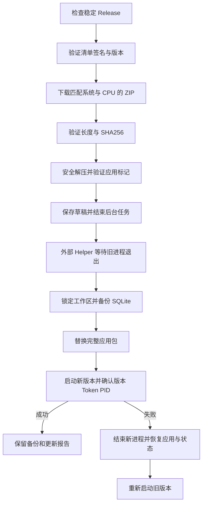

# 构建、签名与应用内更新

> 名称与命令已于 2026-10-03 统一为 SuperLink；历史截图、产物哈希和验收结论仍对应记录当日版本，本次更名验证见 [完整更名记录](superlink-namespace-2026-10-03.md)。

当前验证版本为 v0.1.5，应用与驱动分仓；v0.1.5 已公开为最新稳定版，既有草稿保留。macOS arm64 的原生应用包及本地 Helper 升级已完成自检。
2026-10-07 已完成六个平台的原生构建、数据库测试、驱动握手及安装包验证，并配置
正式更新签名公钥和私钥。平台代码签名证书及 Apple 公证尚未配置；原生安装验证
不能替代各平台图形界面全流程验收。自动流程和验证记录见后文。

## 1. 产物与平台

### macOS 局域网连接权限（2026-10-08）

安装版连接局域网数据库或 SSH 服务器时，需要允许 SuperLink 访问本地网络。
若出现 `no route to host`，而终端能连通同一地址，请检查系统设置 → 隐私与安全性 → 本地网络中的 SuperLink 开关；终端启动的命令行工具可能自动获准，不能作为安装版权限验证。
参见 [Apple TN3179](https://developer.apple.com/documentation/technotes/tn3179-understanding-local-network-privacy)。

构建流程现在写入 `NSLocalNetworkUsageDescription`，并在未配置证书时对整个应用包进行 ad-hoc 签名，绑定 Info.plist 与资源、更新已签名 SQLite Agent 的校验和。
ad-hoc 签名不能保证更新后隐私身份的连续性；可靠分发仍需 `SUPERLINK_MAC_SIGN_IDENTITY` 对应的 Apple 签发证书。构建不会修改用户的网络权限。
本次已通过 UI 测试、静态检查、原生 Mac 构建、DMG 解包与签名检查；安装版真实局域网连接仍需用户授权后验证。修复产物另行生成 v0.1.3，保留既有版本记录。

在目标平台运行：

```sh
python3 tools/build.py --all-drivers --package --version 0.1.0
```

| 位置 | 内容 |
| --- | --- |
| `bin/superlink`、`bin/update-helper` | 主程序与更新 Helper；Windows 带 `.exe` |
| `bin/drivers/` | 所选原生 Agent 和 `bundle.json`，供开发及可信本机离线导入 |
| `bin/SuperLink.app/` | macOS 原生应用包，包含离线 SQLite、Helper 和许可文本 |
| `bin/SuperLink/` | Linux / Windows Portable 应用目录，包含同样的基础资源 |
| `dist/SuperLink_<version>_<os>_<arch>.zip` | 一个完整应用目录的 ZIP |
| `dist/<driver>-agent_<version>_<os>_<arch>[.exe]` | 单独的可选 Agent |
| `dist/assets-<os>-<arch>.json` | 本平台资产清单：长度、SHA256、下载 URL 与驱动兼容信息 |

应用包默认只内置 SQLite。22 个可选 Agent 都构建时，其他驱动仍作为独立资产分发，
避免基础应用包随所有 SDK 一起膨胀。CGO 驱动应在目标系统和架构原生构建并执行握手。
应用及 Agent 均不使用 JVM 管理连接器，也不要求宿主机 JDK。

`--driver` 可重复指定；每次构建会重写所选驱动的 `bundle.json`。需要完整离线目录时
使用 `--all-drivers`。打包必须包含 SQLite，不能与 `--skip-app` 一起使用。

## 2. 更新签名密钥

应用内置一个 Base64 编码的 Ed25519 32 字节公钥。签名工具使用对应的 64 字节私钥。
私钥由维护者保管，不能加入仓库、应用包、Release 或构建日志。

```sh
# 目录和文件名可按维护者的密钥保管方式调整
mkdir -p "$HOME/.config/superlink-release"
chmod 700 "$HOME/.config/superlink-release"

go run ./cmd/release-sign \
  --generate-key-file "$HOME/.config/superlink-release/ed25519.key"
```

工具以 `O_EXCL` 创建文件，已有文件时拒绝覆盖，POSIX 文件权限为 0600；Windows
另行配置该文件的访问 ACL。输出只包含公钥，不显示私钥。

将输出的公钥配置为 `SUPERLINK_RELEASE_PUBLIC_KEY`，再构建每个平台的应用：

```sh
export SUPERLINK_RELEASE_PUBLIC_KEY='替换为生成工具输出的公钥'
python3 tools/build.py --all-drivers --package --version 0.1.0
```

构建脚本检查公钥长度并通过 Go `-ldflags` 写入主程序。GitHub 构建流程读取同名
Repository Variable；不需要将私钥交给普通平台构建任务。未配置公钥的开发包不能
验收正式在线更新。现有客户端固定信任原公钥，直接换钥会使其拒绝后续清单；自动密钥
轮换协议尚未实现。

## 3. 平台代码签名

macOS 设置 `SUPERLINK_MAC_SIGN_IDENTITY` 后，打包脚本先签名 SQLite Agent、Helper
和主程序，重新计算包内 SQLite 校验值，再签名并严格校验 `.app`，最后生成 ZIP。
Ed25519 清单签名与操作系统代码签名承担不同职责，两者不能互相替代。

当前脚本没有自动执行 macOS 公证 / stapling，也没有 Windows Authenticode。
DMG、Inno Setup 和 DEB / tar 安装器已接入自动构建。如果后续对最终 ZIP 或 Agent
做代码签名、重新压缩、公证附加或其他会改变字节的操作，必须重新生成对应的资产长度和 SHA256，之后再签清单。

本次产物未使用平台开发者签名，未完成隔离下载后的 Gatekeeper 验收；安装说明明确提示。
Portable 更新要求当前应用目录及其父目录可写；系统包管理器目录的更新暂不支持提权。

## 4. 合并资产与签名清单

收集各平台的最终文件和 `assets-*.json` 到同一个干净的目录。同一个
`kind / id / os / arch` 不得重复；新构建资产版本和最终 Release tag 必须一致。
采用第 14 节的驱动复用模式时，旧驱动保持原签名记录及版本 URL，不能重命名为新版本。

```sh
go run ./cmd/release-sign \
  --assets-dir dist \
  --version 0.1.0 \
  --channel stable \
  --key-file "$HOME/.config/superlink-release/ed25519.key"
```

工具逐个读取实际产物并检查长度、SHA256、仓库下载 URL 和版本，生成并验证：

- `manifest.json`：schema 1、版本、渠道、时间与所有平台资产。
- `manifest.json.sig`：对清单原始字节的 Ed25519 签名，使用 Base64 文本。

签名后不要再格式化、修改换行或编辑 `manifest.json`。资产文件名严格限制为普通文件名，
应用 ZIP 和单个 Agent 最大 1 GiB。驱动资产还包含上游兼容修订和 `json-lines-v2`
协议身份，由安装流程再次握手校验。

## 5. GitHub Release 发布内容

稳定发布使用目标仓库 `ealink1/super-link`、对应版本 tag（如 `v0.1.1`），上传：

1. 各平台完整应用 ZIP。
2. 各平台可选 Agent。
3. `manifest.json` 与 `manifest.json.sig`。
4. 发布说明与对应的许可归属信息。

清单中的 URL 固定为该仓库 `releases/download/v<version>/` 下的最终文件。
客户端读取 GitHub 的 latest stable Release，拒绝 draft、prerelease、preview 清单，
并绑定 Release tag 与签名清单版本。签名工具能生成 preview 清单，但本版界面尚未提供
preview 渠道切换。

`.github/workflows/build.yml` 原生构建六种系统 / CPU 组合并上传 Actions Artifact；
不会自动创建公开 Release。`.github/workflows/ci.yml` 执行测试、架构 / 来源检查和
默认应用打包。2026-10-07 的云端运行已验证完整矩阵，详见第 9 节。

正式分发前核对 [THIRD_PARTY_NOTICES.md](../THIRD_PARTY_NOTICES.md) 的许可缺失记录，
尤其是专有数据库驱动。本次未获得所有专有驱动的独立再分发条款，也未做公开发布。

## 6. 客户端更新流程

### GitHub API 限流处理（2026-10-08）

默认仓库的 latest API 返回 403/429 时，客户端尝试 GitHub 官方
`/releases/latest` 入口解析公开稳定标签，再从固定标签下载清单与签名。
此路线无需 GitHub Token，仍执行相同的签名、版本、渠道、可信域名和大小校验。
不存在公开稳定版时显示说明；草稿和预发布不会参与更新。
备用入口也被拒绝时，界面提示稍后重试及检查网络/代理。
详见 [403 修复设计](plans/2026-10-08-update-check-403-design.md)。

本机修复包版本为 0.1.4（macOS arm64），已验证 DMG 与 ZIP 内容一致、包内版本、
现有更新公钥及 ad-hoc 签名，并安装至 `/Applications/SuperLink.app`。
旧版应用备份在 `bin/install-backups/`，已有归档保留；本次未创建或公开新 Release。



解压拒绝越界路径、软链接、特殊文件、重名 / 大小写冲突，限制总大小 2 GiB 和文件
数量 5,000。Stage 与目标 / Backup 是同文件系统的独立同级目录；应用 ID、平台、
入口和版本须匹配。未经完整验证不会执行新代码。

退出前取消并等待后台任务，保存当前编辑内容、关闭会话和本地服务。保存失败则中止
本次更新。Helper 的临时副本位于应用目录之外，等待父进程退出后获取同一工作区锁，
通过 SQLite `VACUUM INTO` 创建含 WAL 数据的完整快照，再替换整个应用包。

新版本只有在 Fyne 事件循环完成窗口恢复后才写入健康确认，确认绑定一次性 Token、
目标版本和实际新进程 PID。启动失败 / 超时会结束新进程，恢复旧应用及 SQLite 快照，
处理 WAL / SHM 后重新启动旧版本。本地 `credentials/` 和旧版系统钥匙串都不会在
启动迁移中写入或清除。状态快照仅包含 SQLite，手动完整工作区备份还必须保留
`credentials/` 下的密钥和密文；降级到钥匙串版本不能读取新版本地加密凭据。

本地报告位于 `updates/last-update.json`，成功时包含健康确认进程 PID；状态快照在
`updates/state-<token>.sqlite`，旧应用为目标旁的 `.backup-<token>`。备份含本地业务
状态，应按工作区权限保管；本版没有自动备份清理或手动回滚界面。

开发裸二进制缺少 package marker，只能下载校验后手动安装；原位升级用于可识别的
`.app` / Portable 包。离线本机 Agent 导入需要用户确认其来源，SHA256 保证复制完整性，
不替代来源信任；在线 Agent 安装要求签名 Release 清单。

## 7. 本地验证

```sh
go test ./cmd/release-sign ./internal/infra/release ./internal/infra/update
python3 tools/build.py --all-drivers --package
python3 tools/native-smoke.py --upgrade
```

最后一项在桌面 macOS 图形会话中使用私有测试目录，启动真实 v0.1.0 `.app`，构建
v0.1.1 测试版本并运行实际 Helper，检查完整包替换、新进程健康确认、应用 / 数据备份。
它不替换用户日常应用，也不发布 Release。清单认证由独立测试覆盖；该本地测试不能
替代线上下载、平台签名、系统权限和实际发行版本的验收。


## 8. 自动跨平台 Release

`.github/workflows/build.yml` 是手动构建及可复用构建流程；发布流程统一调用它，避免
手动包和正式包使用不同构建参数。`release.yml` 支持推送 `v*` 标签或手动选择已有标签，
先解析不可变提交 SHA，再由六个原生 runner 构建、执行驱动握手、应用版本探测和 UI 测试。
仅界面 / 文档变化时可自动采用已签名驱动复用，详见第 14 节；以下两仓新建流程适用于完整构建。

| 系统 | 架构 | Runner | 下载格式 |
| --- | --- | --- | --- |
| macOS | amd64 | macos-15-intel | DMG、ZIP |
| macOS | arm64 | macos-15 | DMG、ZIP |
| Windows | amd64 | windows-2025 + GCC 15.2 POSIX/SEH/UCRT | 安装 EXE、ZIP |
| Windows | arm64 | windows-11-arm + CLANGARM64 | 安装 EXE、ZIP |
| Linux | amd64 | ubuntu-22.04 | DEB、tar.gz、ZIP |
| Linux | arm64 | ubuntu-24.04-arm | DEB、tar.gz、ZIP |

Windows 使用 Inno Setup 6.3+，默认安装到当前用户的 LocalAppData/Programs/SuperLink，
无需管理员权限。Linux tar 提供 `install.sh`，安装到用户数据目录并拒绝覆盖现有应用；
DEB 安装到 `/opt/superlink`，通过系统包管理器升级。两者都不包含或删除用户工作区数据。
基础包均包含 SQLite；DuckDB 的现有原生绑定不支持 Windows ARM64，该平台不发布
DuckDB Agent，其余平台构建全部 22 个 Agent。

Windows x64 固定下载并校验 [WinLibs GCC 15.2 POSIX/SEH/UCRT](https://github.com/brechtsanders/winlibs_mingw/releases/tag/15.2.0posix-14.0.0-ucrt-r7)
工具链。本地构建全部驱动时也应使用该工具链：DuckDB 预编译库依赖 GCC 15 的 emutls
符号，无法链接 [MSYS2 GCC 16 的原生 TLS 运行库](https://www.msys2.org/news/#2026-05-11-native-thread-local-storage-tls-with-gcc-16)。
六个平台同时运行 SQLite 数据库及 Agent 协议测试，验证离线查询功能。

macOS 的 DMG 校验后只读挂载，逐文件对照更新 ZIP；Windows 在一次性 CI runner
静默安装到临时目录，检查文件及版本后卸载；Linux 解包 DEB/tar，对照 ZIP，再在临时
用户目录验证便携安装及重复安装保护。额外下载清单为 `downloads-<os>-<arch>.json`。
运行时的 `assets-*.json` 仍只记录更新 ZIP 和驱动，不改变客户端协议。

发布汇总任务拒绝缺平台、缺驱动、旧版本、错误编译公钥、坏哈希、ZIP 越界路径及包内
SQLite 哈希不符。签名任务校验公私钥匹配，再签署已有应用更新协议的清单。
发布说明由 `feat` / `fix` / `perf` 等提交标题分类，包含带体积的下载表格和安装说明。
签名后的完整清单包含应用与驱动，驱动 URL 指向独立仓库 `ealink1/SuperLink-DriverAgents`。
主 Release 仅上传 14 个应用包、发布说明、清单及签名和独立校验文件（18 个文件）；
驱动 Release 上传 131 个驱动、同一清单及签名和独立校验文件（134 个文件）。
平台元数据仍保存在 Actions Artifact，供完整构建验证，不上传到公开 Release。

拆分前拒绝未声明的额外文件（包括意外放入 dist 的密钥）、目录和符号链接。两个仓库
分别生成 `SHA256SUMS.txt`，再对照 GitHub API 的每个资产名称、长度和 SHA256 digest。
两个草稿均校验成功后才允许公开；公开时先驱动、后应用。

推送标签默认只创建 **草稿**。勾选手动流程的 `publish` 才会在全部验证成功后公开发布；
公开发布必须配置更新密钥及跨仓库授权。未配置密钥时允许生成验证用草稿，发布说明明确提示
在线更新及在线驱动安装不可用。已有 Release 不会被覆盖；失败上传保留草稿供检查。

- Repository Variable：`SUPERLINK_RELEASE_PUBLIC_KEY`（Base64 32 字节公钥）。
- Repository Secret：`SUPERLINK_RELEASE_PRIVATE_KEY`（Base64 64 字节私钥）。
- 跨仓库发布 Secret：`SUPERLINK_DRIVER_RELEASE_TOKEN`，推荐使用仅授予
  `ealink1/SuperLink-DriverAgents` Contents 读写权限的细粒度令牌。普通 GITHUB_TOKEN
  只用于主仓库；驱动令牌仅交给访问检查和发布步骤，构建不获取该令牌。

驱动仓库须初始化默认 `main` 分支（README 指向主项目及许可来源）。发布器创建对应
版本标签，不修改已有标签；驱动发布正文记录主项目源码提交。既有草稿不会自动覆盖。

维护者仍需自行配置 Apple Developer / Windows 代码签名和 Apple 公证；更新清单签名
不等同于操作系统代码签名。当前自动流程没有导入平台证书或执行公证，发布说明会提示。

首次执行前，应提交全部构建输入并完成云端构建验证。在 GitHub Actions 手动运行
**Build native application packages** 即可只构建六个平台、不创建 Release。正式发版时：

```sh
git tag -a v0.1.0 -m "SuperLink v0.1.0"
git push origin v0.1.0
```

如需通过 CLI 配置密钥，先完成 GitHub CLI 认证，再从安全存储读取私钥给
`gh secret set SUPERLINK_RELEASE_PRIVATE_KEY` 的标准输入，禁止粘贴到命令参数或日志。
已有正式签名身份不得覆盖；生成命令见前文。

本地验证（完整六平台合并验证由 CI 执行）：

```sh
python3 -m unittest discover -s tools -p 'test_release_*.py' -v
python3 tools/package_installers.py --version 0.1.0
python3 tools/smoke_installers.py --version 0.1.0
python3 tools/verify_release.py --version 0.1.0 --platform darwin/arm64
python3 tools/release_notes.py --version 0.1.0 --platform darwin/arm64
actionlint .github/workflows/*.yml
```

本地限定平台生成的说明是预览，不允许被完整发布验证器上传。跨平台工作流通过与否、
GitHub 上传验证、操作系统首次安装和线上更新结果必须以真实 CI/宿主机执行结果为准。


## 9. 云端验收记录（2026-10-07 / 08）

初次六平台构建提交：`0dda6249b0a392c9ca0ada35785b52e9fb8f3b27`。
最终发布提交：`cade0256fb335f021c0513e1d601d4290ba3b7f2`；标签：`v0.1.1`。

- [完整 CI](https://github.com/ealink1/super-link/actions/runs/37642766797)：通过全量测试、竞态检查、静态检查和原生 Linux 构建。
- [六平台原生构建](https://github.com/ealink1/super-link/actions/runs/37642963455)：macOS、Windows、Linux 的 amd64 / arm64 全部通过。
- 六个平台均执行 UI、状态存储、SQLite 数据库及 Agent 协议测试；逐个构建、启动并验证全部可用驱动身份。Windows ARM64 为 21 个驱动，其余平台为 22 个。
- macOS 验证 DMG 挂载及包内文件；Windows 执行实际安装、应用版本检查及卸载；Linux 验证 DEB 解包、tar 用户安装和重复安装保护。
- Apple 公证、Windows Authenticode 及各系统完整图形交互验收仍未完成。本次未使用浏览器测试。

最终发布验收：

- [v0.1.1 完整 CI](https://github.com/ealink1/super-link/actions/runs/37648676735)：通过。
- [v0.1.1 Release 完整流程](https://github.com/ealink1/super-link/actions/runs/37648677534)：六个平台重建、签名、发布说明、上传与 GitHub 资产校验全部通过。
- [已验证的 Release 草稿](https://github.com/ealink1/super-link/releases/tag/untagged-70efe7b616c18af71936)：共 167 个文件，含 14 个应用安装 / 更新包、131 个可选驱动、平台元数据、说明、校验文件和签名清单。尚未公开发布，草稿需仓库授权访问，应用内稳定更新不会读取草稿。
- 独立下载 `manifest.json`、签名、说明和校验文件，以应用实际使用的 `release.Verify` 验证签名、schema 和版本；137 个更新 / 驱动资产验证通过。
- 独立比对全部 167 个 GitHub 资产 digest 与 `SHA256SUMS.txt`，并检查发布正文与上传说明一致、14 个下载链接均对应上传资产。
- 首次 v0.1.0 发布在上传后遇到 GitHub 按标签查询草稿返回 404。该标签未修改；发布器改用包含授权草稿的近期列表及 Release ID，新增回归测试（发布测试共 16 项），并在 v0.1.1 完整重跑验证。


## 10. 分仓发布验收（2026-10-08）

验证提交：`9a3eb61be0d98626368b1c7bafb2134b64356055`；标签：`v0.1.2`。

- [完整 CI](https://github.com/ealink1/super-link/actions/runs/37713725206)：通过。
- [六平台及分仓发布完整流程](https://github.com/ealink1/super-link/actions/runs/37713725579)：通过原生构建、安装包验证、清单签名、两个仓库上传及所有资产大小 / SHA256 校验。
- [应用草稿](https://github.com/ealink1/super-link/releases/tag/untagged-11d99f5c3a1aefab36be)：18 个上传文件，不包含可选驱动或平台构建元数据。GitHub 另附两个源码下载项。
- [驱动草稿](https://github.com/ealink1/SuperLink-DriverAgents/releases/tag/untagged-246923096e7335d90879)：134 个上传文件，含 131 个驱动、清单、签名及独立校验文件。
- 独立下载两个仓库的签名清单及校验文件，确认清单与签名字节完全一致；主草稿正文和 14 个应用包链接与实际资产对应，137 个更新 / 驱动 URL 分别指向正确仓库。
- 使用应用实际的 `release.Verify` 验证下载清单的 Ed25519 签名、schema 和 v0.1.2 版本；分别核对全部 18 / 134 个 GitHub digest 与对应的 SHA256SUMS.txt，全部通过。
- 本地 19 项发布测试、Go 测试、竞态检查和静态检查通过；本机 22 个驱动及应用原生构建、DMG 校验和挂载文件比对通过。未使用浏览器测试。

已有 v0.1.0 / v0.1.1 发布及标签保持原样；本次未公开发布。分仓清单需要 v0.1.2
及后续客户端的仓库白名单支持，请分发最新应用包。Apple 公证、Windows Authenticode
及各系统完整图形交互验收仍未完成。

## 11. v0.1.3 安装包修复验证（2026-10-08）

- 修复源码：`dedef0581aa89a47a24bebc38faa47888ca651b4`，不可变标签 `v0.1.3`。
- [完整 CI 检查](https://github.com/ealink1/super-link/actions/runs/37717650522)通过。
- [六平台构建与两仓上传](https://github.com/ealink1/super-link/actions/runs/37717651175)通过，包含原生测试、驱动握手、安装与解包检查、版本探测及产物校验。
- [应用草稿](https://github.com/ealink1/super-link/releases/tag/untagged-ae1bd5007cf49cc09d15)：18 个上传文件，其中 14 个应用安装或更新包。
- [驱动草稿](https://github.com/ealink1/SuperLink-DriverAgents/releases/tag/untagged-9b87803795c524874e07)：134 个上传文件，其中 131 个驱动。
- 上传后独立核对全部 152 个文件的清单及 GitHub SHA-256；下载两仓元数据并验证 Ed25519 签名、137 条更新清单记录和 14 个安装包下载链接，两仓使用相同的签名清单。
- 实际下载云端 Mac ARM64 更新 ZIP，检查归档完整性、v0.1.3 版本、网络用途声明、已签名 SQLite 校验和，并通过 `codesign --verify --deep --strict`。
- 本次保持草稿状态；正文中的正式版本下载地址在公开发布后生效，草稿下载请使用 Assets。历史 v0.1.2 及更早版本均保留。
- 图形界面中的真实数据库连接仍需用户允许 macOS 本地网络权限后验证；上述构建验证不代表已完成真实 MySQL 认证。

## 12. v0.1.4 更新检查修复验证（2026-10-08）

- 修复源码：`7e6315df15d1049c65efe1b1085be6028ded8e2c`；不可变标签 `v0.1.4`。
- [主分支完整 CI](https://github.com/ealink1/super-link/actions/runs/37722107103)和
  [标签完整 CI](https://github.com/ealink1/super-link/actions/runs/37722107064)均通过。
- [六平台构建及分仓发布](https://github.com/ealink1/super-link/actions/runs/37722107386)通过，
  包含原生 UI 测试、驱动构建与握手、安装包验证、清单签名、上传及大小/SHA256 校验。
- [应用草稿](https://github.com/ealink1/super-link/releases/tag/untagged-ef61122e0c37b437f65e)：18 个文件。
- [驱动草稿](https://github.com/ealink1/SuperLink-DriverAgents/releases/tag/untagged-a6de9e16ef7e8ab469f5)：134 个文件。
- 上传后独立下载两仓清单、签名及 SHA256SUMS，逐项核对 152 个 GitHub 资产 digest，全部通过。
  两仓签名清单字节一致；使用应用的 `release.Verify` 验证 Ed25519 签名、stable 渠道、
  0.1.4 版本及 137 条更新记录（6 个应用 ZIP、131 个驱动）。
- GitHub 发布公钥与本机已安装 0.1.4 的内置公钥一致。
- 保持草稿状态，尚未公开，不参与应用内稳定更新；既有标签和 Release 未修改。
  本次未使用浏览器测试，安装版按钮点击的原生截图验收仍未完成，详见修复设计。

## 13. v0.1.5 公开稳定版及在线更新验证（2026-10-08）

- 源码：`42c36219189d64149eb3124bd72ce7bed22af78f`；不可变标签 `v0.1.5`。
  macOS 标题栏工作区选择采用绿色下划线。
- [主分支 CI](https://github.com/ealink1/super-link/actions/runs/37726667901)、
  [标签 CI](https://github.com/ealink1/super-link/actions/runs/37726668232)及
  [六平台完整发布流程](https://github.com/ealink1/super-link/actions/runs/37726668575)全部成功。
- 上传后独立验证应用 18 / 驱动 134 个资产的 GitHub digest 与 SHA256SUMS；
  两仓签名清单字节一致。使用 0.1.4 内置公钥验证 0.1.5 的签名、stable 渠道与
  137 条更新记录（6 个应用 ZIP、131 个驱动）。
- 校验完成后先公开[驱动版本](https://github.com/ealink1/SuperLink-DriverAgents/releases/tag/v0.1.5)，
  再公开[应用版本](https://github.com/ealink1/super-link/releases/tag/v0.1.5)，均设为 latest，
  draft=false、prerelease=false。历史标签和 Release 保持原样。
- 使用应用实际更新客户端，在无 GitHub 凭据的请求中发现 0.1.4 → 0.1.5；
  强制模拟 API 403 后，真实 GitHub 备用入口仍可读取并验证公开的 0.1.5。
- 通过实际客户端下载公开 macOS arm64 更新 ZIP，长度及 SHA256 通过；安全解压、
  平台身份、版本、Helper 元数据、原生版本探测和 `codesign --verify --deep --strict` 通过。
- 未替用户运行应用内安装，用户可从已安装的 0.1.4 测试升级；实际退出、替换、健康确认
  和下划线视觉效果由此次用户测试验收。本次未使用浏览器测试。


## 14. 发布耗时优化（2026-10-08，本地验证）

v0.1.5 的六平台 Release 用时 781 秒，Windows ARM64 构建 532 秒，汇总阶段 223 秒。
优化后的工作流对纯 UI、品牌资源或文档变化复用最新公开稳定版本的已签名驱动；
依赖、驱动、运行时或发布工具变化仍完整构建，准备阶段无法认证基线时自动回退。

六平台应用、离线 SQLite、原生测试及安装包校验保持执行。快速模式保留 131 个
驱动的原 URL / 文件名 / 哈希 / 兼容信息，新签名清单仍完整；只上传新的应用版本，
不创建或修改驱动仓库版本。公开前再次验证原驱动资产大小与 GitHub SHA256 digest。
发布说明指向实际沿用的驱动版本。完整模式仍先验证两仓草稿，公开时先驱动后应用。

普通 CI 不再由版本标签重复触发。Go 编译 / 模块缓存按平台、依赖及应用 / 完整模式
隔离，Windows x64 缓存既有固定 GCC 15 压缩包且每次校验其 SHA256。
`build.py --application-only --package` 生成带新 SQLite 的基础包，须配合完整认证复用
证明使用；`--dist` 与 `--binary-dir` 可隔离本地验证产物，正式默认路径不变。

26 项 Python 契约测试、Go 签名 / 清单 race 测试、go vet、工作流静态检查、架构与
源文件大小检查通过。真实 v0.1.5 签名及 131 个远端驱动验证通过。Mac ARM64 独立
验证包构建、签名、DMG、ZIP / 复用元数据校验与安装包解包字节对照通过；未使用浏览器。
本地临时版本号 0.1.6 未安装或发布，产物在 `bin/release-optimization-check/`。

本次工作流修改本身要求下一次完整构建，后续符合条件的 UI 版本才走快速模式。
尚未提交、推送或运行优化后的云端发布，六平台实际耗时及缓存效果待测。
设计与验证细节见 [发布优化方案](plans/2026-10-08-release-optimization-design.md)。

## 15. v0.1.6 更新与界面改进（2026-10-08）

- 启动完成后自动检查稳定版本，发现新版时复用设置中心的确认、下载及安装流程；
  无新版本或自动检查失败时不打扰用户。下载显示进度、大小和取消操作。
- 单击数据库打开表目录标签，支持表名 / Schema 筛选、刷新及双击打开数据。
  MySQL / MariaDB 展示行数、数据长度、引擎、日期、排序规则和注释；
  行数采用数据库统计值，可能为估算值。目录移除格子线，所有列左对齐。
- 工作标签使用绿色选中点，移除启动欢迎页；连接未建立时隐藏状态点，
  数据库条目不显示连接状态点。Shell 默认打开主机管理，修复卡片备注溢出及文字对齐。
- 包含第 14 节的发布流程优化，本次因发布工具及运行时变更执行完整六平台构建。
- 发布过程不使用浏览器，保留既有标签和 Release；操作系统签名仍取决于已配置证书。

### v0.1.6 发布验证结果

- 源码提交 `e32e604a428d3feca7b75d1e3e5c892afe11de37`，不可变标签 `v0.1.6`。
- [主分支 CI](https://github.com/ealink1/super-link/actions/runs/37735316572)与
  [完整六平台发布](https://github.com/ealink1/super-link/actions/runs/37735321847)成功。
- 本地全量测试、go vet、相关竞态测试、26 项 Python 发布契约测试、actionlint、
  架构 / 文件大小 / 上游 / Fyne / 资源归属校验通过。
- 独立验证应用 18 与驱动 134 个资产摘要，两仓清单及签名字节一致，签名验证通过。
  按驱动、应用顺序公开，均设为 latest 稳定版本；历史发布保持原样。
- 匿名实际更新客户端发现 0.1.5 → 0.1.6，验证 137 条签名记录，下载 Mac ARM64 ZIP
  并通过精确大小 / SHA256、安全解压、包身份和版本、原生版本探测与严格代码签名校验。
- [应用下载](https://github.com/ealink1/super-link/releases/tag/v0.1.6)；
  [驱动下载](https://github.com/ealink1/SuperLink-DriverAgents/releases/tag/v0.1.6)。
- 已重新构建并启动带正式更新公钥的本地 0.1.6 测试程序；未替用户安装发行包，未使用浏览器。
