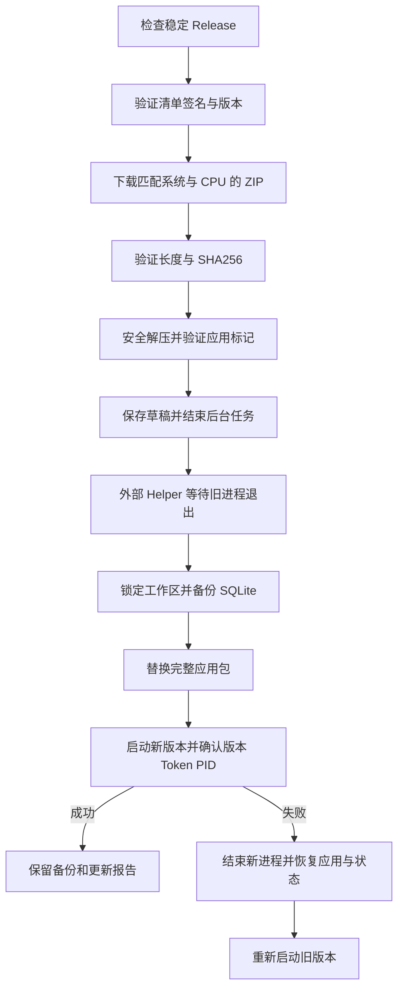

# 构建、签名与应用内更新

> 名称与命令已于 2026-10-03 统一为 SuperLink；历史截图、产物哈希和验收结论仍对应记录当日版本，本次更名验证见 [完整更名记录](superlink-namespace-2026-10-03.md)。

当前验证版本为 v0.1.1 Alpha，GitHub Release 保留为草稿。macOS arm64 的原生应用包及本地 Helper 升级已完成自检。
2026-10-07 已完成六个平台的原生构建、数据库测试、驱动握手及安装包验证，并配置
正式更新签名公钥和私钥。平台代码签名证书及 Apple 公证尚未配置；原生安装验证
不能替代各平台图形界面全流程验收。自动流程和验证记录见后文。

## 1. 产物与平台

在目标平台运行：

```sh
python3 tools/build.py --all-drivers --package --version 0.1.0
```

| 位置 | 内容 |
| --- | --- |
| `bin/superlink`、`bin/update-helper` | 主程序与更新 Helper；Windows 带 `.exe` |
| `bin/drivers/` | 所选原生 Agent 和 `bundle.json`，供开发及可信本机离线导入 |
| `bin/SuperLink.app/` | macOS 原生应用包，包含离线 SQLite、Helper 和许可文本 |
| `bin/SuperLink/` | Linux / Windows Portable 应用目录，包含同样的基础资源 |
| `dist/superlink_<version>_<os>_<arch>.zip` | 一个完整应用目录的 ZIP |
| `dist/<driver>-agent_<version>_<os>_<arch>[.exe]` | 单独的可选 Agent |
| `dist/assets-<os>-<arch>.json` | 本平台资产清单：长度、SHA256、下载 URL 与驱动兼容信息 |

应用包默认只内置 SQLite。22 个可选 Agent 都构建时，其他驱动仍作为独立资产分发，
避免基础应用包随所有 SDK 一起膨胀。CGO 驱动应在目标系统和架构原生构建并执行握手。
应用及 Agent 均不使用 JVM 管理连接器，也不要求宿主机 JDK。

`--driver` 可重复指定；每次构建会重写所选驱动的 `bundle.json`。需要完整离线目录时
使用 `--all-drivers`。打包必须包含 SQLite，不能与 `--skip-app` 一起使用。

## 2. 更新签名密钥

应用内置一个 Base64 编码的 Ed25519 32 字节公钥。签名工具使用对应的 64 字节私钥。
私钥由维护者保管，不能加入仓库、应用包、Release 或构建日志。

```sh
# 目录和文件名可按维护者的密钥保管方式调整
mkdir -p "$HOME/.config/superlink-release"
chmod 700 "$HOME/.config/superlink-release"

go run ./cmd/release-sign \
  --generate-key-file "$HOME/.config/superlink-release/ed25519.key"
```

工具以 `O_EXCL` 创建文件，已有文件时拒绝覆盖，POSIX 文件权限为 0600；Windows
另行配置该文件的访问 ACL。输出只包含公钥，不显示私钥。

将输出的公钥配置为 `SUPERLINK_RELEASE_PUBLIC_KEY`，再构建每个平台的应用：

```sh
export SUPERLINK_RELEASE_PUBLIC_KEY='替换为生成工具输出的公钥'
python3 tools/build.py --all-drivers --package --version 0.1.0
```

构建脚本检查公钥长度并通过 Go `-ldflags` 写入主程序。GitHub 构建流程读取同名
Repository Variable；不需要将私钥交给普通平台构建任务。未配置公钥的开发包不能
验收正式在线更新。现有客户端固定信任原公钥，直接换钥会使其拒绝后续清单；自动密钥
轮换协议尚未实现。

## 3. 平台代码签名

macOS 设置 `SUPERLINK_MAC_SIGN_IDENTITY` 后，打包脚本先签名 SQLite Agent、Helper
和主程序，重新计算包内 SQLite 校验值，再签名并严格校验 `.app`，最后生成 ZIP。
Ed25519 清单签名与操作系统代码签名承担不同职责，两者不能互相替代。

当前脚本没有自动执行 macOS 公证 / stapling，也没有 Windows Authenticode。
DMG、Inno Setup 和 DEB / tar 安装器已接入自动构建。如果后续对最终 ZIP 或 Agent
做代码签名、重新压缩、公证附加或其他会改变字节的操作，必须重新生成对应的资产长度和 SHA256，之后再签清单。

本次产物未使用平台开发者签名，未完成隔离下载后的 Gatekeeper 验收；安装说明明确提示。
Portable 更新要求当前应用目录及其父目录可写；系统包管理器目录的更新暂不支持提权。

## 4. 合并资产与签名清单

收集各平台的最终文件和 `assets-*.json` 到同一个干净的目录。同一个
`kind / id / os / arch` 不得重复；所有资产版本和最终 Release tag 必须一致。

```sh
go run ./cmd/release-sign \
  --assets-dir dist \
  --version 0.1.0 \
  --channel stable \
  --key-file "$HOME/.config/superlink-release/ed25519.key"
```

工具逐个读取实际产物并检查长度、SHA256、仓库下载 URL 和版本，生成并验证：

- `manifest.json`：schema 1、版本、渠道、时间与所有平台资产。
- `manifest.json.sig`：对清单原始字节的 Ed25519 签名，使用 Base64 文本。

签名后不要再格式化、修改换行或编辑 `manifest.json`。资产文件名严格限制为普通文件名，
应用 ZIP 和单个 Agent 最大 1 GiB。驱动资产还包含上游兼容修订和 `json-lines-v2`
协议身份，由安装流程再次握手校验。

## 5. GitHub Release 发布内容

稳定发布使用目标仓库 `ealink1/super-link`、对应版本 tag（如 `v0.1.1`），上传：

1. 各平台完整应用 ZIP。
2. 各平台可选 Agent。
3. `manifest.json` 与 `manifest.json.sig`。
4. 发布说明与对应的许可归属信息。

清单中的 URL 固定为该仓库 `releases/download/v<version>/` 下的最终文件。
客户端读取 GitHub 的 latest stable Release，拒绝 draft、prerelease、preview 清单，
并绑定 Release tag 与签名清单版本。签名工具能生成 preview 清单，但本版界面尚未提供
preview 渠道切换。

`.github/workflows/build.yml` 原生构建六种系统 / CPU 组合并上传 Actions Artifact；
不会自动创建公开 Release。`.github/workflows/ci.yml` 执行测试、架构 / 来源检查和
默认应用打包。2026-10-07 的云端运行已验证完整矩阵，详见第 9 节。

正式分发前核对 [THIRD_PARTY_NOTICES.md](../THIRD_PARTY_NOTICES.md) 的许可缺失记录，
尤其是专有数据库驱动。本次未获得所有专有驱动的独立再分发条款，也未做公开发布。

## 6. 客户端更新流程



解压拒绝越界路径、软链接、特殊文件、重名 / 大小写冲突，限制总大小 2 GiB 和文件
数量 5,000。Stage 与目标 / Backup 是同文件系统的独立同级目录；应用 ID、平台、
入口和版本须匹配。未经完整验证不会执行新代码。

退出前取消并等待后台任务，保存当前编辑内容、关闭会话和本地服务。保存失败则中止
本次更新。Helper 的临时副本位于应用目录之外，等待父进程退出后获取同一工作区锁，
通过 SQLite `VACUUM INTO` 创建含 WAL 数据的完整快照，再替换整个应用包。

新版本只有在 Fyne 事件循环完成窗口恢复后才写入健康确认，确认绑定一次性 Token、
目标版本和实际新进程 PID。启动失败 / 超时会结束新进程，恢复旧应用及 SQLite 快照，
处理 WAL / SHM 后重新启动旧版本。本地 `credentials/` 和旧版系统钥匙串都不会在
启动迁移中写入或清除。状态快照仅包含 SQLite，手动完整工作区备份还必须保留
`credentials/` 下的密钥和密文；降级到钥匙串版本不能读取新版本地加密凭据。

本地报告位于 `updates/last-update.json`，成功时包含健康确认进程 PID；状态快照在
`updates/state-<token>.sqlite`，旧应用为目标旁的 `.backup-<token>`。备份含本地业务
状态，应按工作区权限保管；本版没有自动备份清理或手动回滚界面。

开发裸二进制缺少 package marker，只能下载校验后手动安装；原位升级用于可识别的
`.app` / Portable 包。离线本机 Agent 导入需要用户确认其来源，SHA256 保证复制完整性，
不替代来源信任；在线 Agent 安装要求签名 Release 清单。

## 7. 本地验证

```sh
go test ./cmd/release-sign ./internal/infra/release ./internal/infra/update
python3 tools/build.py --all-drivers --package
python3 tools/native-smoke.py --upgrade
```

最后一项在桌面 macOS 图形会话中使用私有测试目录，启动真实 v0.1.0 `.app`，构建
v0.1.1 测试版本并运行实际 Helper，检查完整包替换、新进程健康确认、应用 / 数据备份。
它不替换用户日常应用，也不发布 Release。清单认证由独立测试覆盖；该本地测试不能
替代线上下载、平台签名、系统权限和实际发行版本的验收。


## 8. 自动跨平台 Release

`.github/workflows/build.yml` 是手动构建及可复用构建流程；发布流程统一调用它，避免
手动包和正式包使用不同构建参数。`release.yml` 支持推送 `v*` 标签或手动选择已有标签，
先解析不可变提交 SHA，再由六个原生 runner 构建、执行驱动握手、应用版本探测和 UI 测试。

| 系统 | 架构 | Runner | 下载格式 |
| --- | --- | --- | --- |
| macOS | amd64 | macos-15-intel | DMG、ZIP |
| macOS | arm64 | macos-15 | DMG、ZIP |
| Windows | amd64 | windows-2025 + GCC 15.2 POSIX/SEH/UCRT | 安装 EXE、ZIP |
| Windows | arm64 | windows-11-arm + CLANGARM64 | 安装 EXE、ZIP |
| Linux | amd64 | ubuntu-22.04 | DEB、tar.gz、ZIP |
| Linux | arm64 | ubuntu-24.04-arm | DEB、tar.gz、ZIP |

Windows 使用 Inno Setup 6.3+，默认安装到当前用户的 LocalAppData/Programs/SuperLink，
无需管理员权限。Linux tar 提供 `install.sh`，安装到用户数据目录并拒绝覆盖现有应用；
DEB 安装到 `/opt/superlink`，通过系统包管理器升级。两者都不包含或删除用户工作区数据。
基础包均包含 SQLite；DuckDB 的现有原生绑定不支持 Windows ARM64，该平台不发布
DuckDB Agent，其余平台构建全部 22 个 Agent。

Windows x64 固定下载并校验 [WinLibs GCC 15.2 POSIX/SEH/UCRT](https://github.com/brechtsanders/winlibs_mingw/releases/tag/15.2.0posix-14.0.0-ucrt-r7)
工具链。本地构建全部驱动时也应使用该工具链：DuckDB 预编译库依赖 GCC 15 的 emutls
符号，无法链接 [MSYS2 GCC 16 的原生 TLS 运行库](https://www.msys2.org/news/#2026-05-11-native-thread-local-storage-tls-with-gcc-16)。
六个平台同时运行 SQLite 数据库及 Agent 协议测试，验证离线查询功能。

macOS 的 DMG 校验后只读挂载，逐文件对照更新 ZIP；Windows 在一次性 CI runner
静默安装到临时目录，检查文件及版本后卸载；Linux 解包 DEB/tar，对照 ZIP，再在临时
用户目录验证便携安装及重复安装保护。额外下载清单为 `downloads-<os>-<arch>.json`。
运行时的 `assets-*.json` 仍只记录更新 ZIP 和驱动，不改变客户端协议。

发布汇总任务拒绝缺平台、缺驱动、旧版本、错误编译公钥、坏哈希、ZIP 越界路径及包内
SQLite 哈希不符。签名任务校验公私钥匹配，再签署已有应用更新协议的清单。
发布说明由 `feat` / `fix` / `perf` 等提交标题分类，包含带体积的下载表格和安装说明。
`SHA256SUMS.txt` 覆盖全部上传文件。上传时拒绝未声明的额外文件（包括意外放入 dist
的密钥），再对照 GitHub API 返回的每个资产名称、长度和 SHA256 digest。

推送标签默认只创建 **草稿**。勾选手动流程的 `publish` 才会在全部验证成功后公开发布；
公开发布必须同时配置以下两项。未配置密钥时允许生成验证用草稿，发布说明明确提示
在线更新及在线驱动安装不可用。已有 Release 不会被覆盖；失败上传保留草稿供检查。

- Repository Variable：`SUPERLINK_RELEASE_PUBLIC_KEY`（Base64 32 字节公钥）。
- Repository Secret：`SUPERLINK_RELEASE_PRIVATE_KEY`（Base64 64 字节私钥）。

维护者仍需自行配置 Apple Developer / Windows 代码签名和 Apple 公证；更新清单签名
不等同于操作系统代码签名。当前自动流程没有导入平台证书或执行公证，发布说明会提示。

首次执行前，应提交全部构建输入并完成云端构建验证。在 GitHub Actions 手动运行
**Build native application packages** 即可只构建六个平台、不创建 Release。正式发版时：

```sh
git tag -a v0.1.0 -m "SuperLink v0.1.0"
git push origin v0.1.0
```

如需通过 CLI 配置密钥，先完成 GitHub CLI 认证，再从安全存储读取私钥给
`gh secret set SUPERLINK_RELEASE_PRIVATE_KEY` 的标准输入，禁止粘贴到命令参数或日志。
已有正式签名身份不得覆盖；生成命令见前文。

本地验证（完整六平台合并验证由 CI 执行）：

```sh
python3 -m unittest discover -s tools -p 'test_release_*.py' -v
python3 tools/package_installers.py --version 0.1.0
python3 tools/smoke_installers.py --version 0.1.0
python3 tools/verify_release.py --version 0.1.0 --platform darwin/arm64
python3 tools/release_notes.py --version 0.1.0 --platform darwin/arm64
actionlint .github/workflows/*.yml
```

本地限定平台生成的说明是预览，不允许被完整发布验证器上传。跨平台工作流通过与否、
GitHub 上传验证、操作系统首次安装和线上更新结果必须以真实 CI/宿主机执行结果为准。


## 9. 云端验收记录（2026-10-07 / 08）

初次六平台构建提交：`0dda6249b0a392c9ca0ada35785b52e9fb8f3b27`。
最终发布提交：`cade0256fb335f021c0513e1d601d4290ba3b7f2`；标签：`v0.1.1`。

- [完整 CI](https://github.com/ealink1/super-link/actions/runs/37642766797)：通过全量测试、竞态检查、静态检查和原生 Linux 构建。
- [六平台原生构建](https://github.com/ealink1/super-link/actions/runs/37642963455)：macOS、Windows、Linux 的 amd64 / arm64 全部通过。
- 六个平台均执行 UI、状态存储、SQLite 数据库及 Agent 协议测试；逐个构建、启动并验证全部可用驱动身份。Windows ARM64 为 21 个驱动，其余平台为 22 个。
- macOS 验证 DMG 挂载及包内文件；Windows 执行实际安装、应用版本检查及卸载；Linux 验证 DEB 解包、tar 用户安装和重复安装保护。
- Apple 公证、Windows Authenticode 及各系统完整图形交互验收仍未完成。本次未使用浏览器测试。

最终发布验收：

- [v0.1.1 完整 CI](https://github.com/ealink1/super-link/actions/runs/37648676735)：通过。
- [v0.1.1 Release 完整流程](https://github.com/ealink1/super-link/actions/runs/37648677534)：六个平台重建、签名、发布说明、上传与 GitHub 资产校验全部通过。
- [已验证的 Release 草稿](https://github.com/ealink1/super-link/releases/tag/untagged-70efe7b616c18af71936)：共 167 个文件，含 14 个应用安装 / 更新包、131 个可选驱动、平台元数据、说明、校验文件和签名清单。尚未公开发布，草稿需仓库授权访问，应用内稳定更新不会读取草稿。
- 独立下载 `manifest.json`、签名、说明和校验文件，以应用实际使用的 `release.Verify` 验证签名、schema 和版本；137 个更新 / 驱动资产验证通过。
- 独立比对全部 167 个 GitHub 资产 digest 与 `SHA256SUMS.txt`，并检查发布正文与上传说明一致、14 个下载链接均对应上传资产。
- 首次 v0.1.0 发布在上传后遇到 GitHub 按标签查询草稿返回 404。该标签未修改；发布器改用包含授权草稿的近期列表及 Release ID，新增回归测试（发布测试共 16 项），并在 v0.1.1 完整重跑验证。
